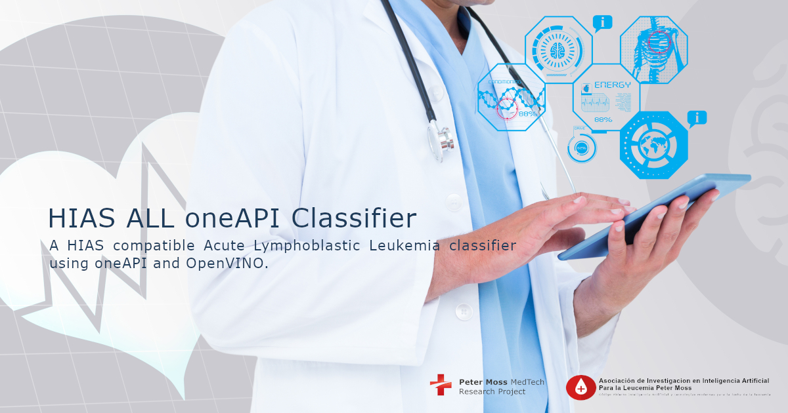

# Asociación de Investigacion en Inteligencia Artificial Para la Leucemia Peter Moss
## Acute Lymphoblastic Leukemia oneAPI Classifier

    

   

 

&nbsp;

# Introduction

The **Acute Lymphoblastic Leukemia (ALL) oneAPI Classifier** is an open-source classifier programmed using the  [Intel® Distribution for Python*](https://software.intel.com/content/www/us/en/develop/tools/distribution-for-python.html) and trained using [Intel® Optimization for TensorFlow*](https://software.intel.com/content/www/us/en/develop/articles/intel-optimization-for-tensorflow-installation-guide.html). The model is deployed on a Raspberry 4 using [Intel® Distribution of OpenVINO™ Toolkit](https://software.intel.com/content/www/us/en/develop/tools/openvino-toolkit.html) and inference is carried out using the [Intel® Neural Compute Stick 2 (Intel® NCS2)](https://software.intel.com/content/www/us/en/develop/hardware/neural-compute-stick.html).

&nbsp;

# DISCLAIMER

_This project should be used for research purposes only. The purpose of the project is to show the potential of Artificial Intelligence for medical support systems such as diagnostic systems._

_Although the model is accurate and shows good results both on paper and in real world testing, it is trained on a small amount of data and needs to be trained on larger datasets to really evaluate it's accuracy._

_Developers that have contributed to this repository have experience in using Artificial Intelligence for detecting certain types of cancer. They are not doctors, medical or cancer experts._

&nbsp;

# Motivation

The motivation for this project came from the interest in exploring how Intel technologies could be used to create an improved version of the [Acute Lymphoblastic Leukemia Tensorflow 2020](https://github.com/AMLResearchProject/ALL-Tensorflow-Classifier-2020) project.

&nbsp;

# Acute Lymphoblastic Leukemia

[Acute lymphoblastic leukemia (ALL)](https://www.leukemiaairesearch.com/research/leukemia), also known as Acute Lymphocytic Leukemia, is a cancer that affects the lymphoid blood cell lineage. It is the most common leukemia in children, and it accounts for 10-20% of acute leukemias in adults. The prognosis for both adult and especially childhood ALL has improved substantially since the 1970s. The 5- year survival is approximately 95% in children. In adults, the 5-year survival varies between 25% and 75%, with more favorable results in younger than in older patients.

For more information about Acute Lymphoblastic Leukemia  please visit our [Leukemia Information Page](https://www.leukemiaairesearch.com/research/leukemia)

&nbsp;

# ALL-IDB
You need to be granted access to use the Acute Lymphoblastic Leukemia Image Database for Image Processing dataset. You can find the application form and information about getting access to the dataset on [this page](https://homes.di.unimi.it/scotti/all/#download) as well as information on how to contribute back to the project [here](https://homes.di.unimi.it/scotti/all/results.php). If you are not able to obtain a copy of the dataset please feel free to try this tutorial on your own dataset, we would be very happy to find additional AML & ALL datasets.

## ALL_IDB1
In this project, [ALL-IDB1](https://homes.di.unimi.it/scotti/all/#datasets) is used, one of the datsets from the Acute Lymphoblastic Leukemia Image Database for Image Processing dataset. We will use data augmentation to increase the amount of training and testing data we have.

&nbsp;

# Intel® Technologies

## Intel® Distribution for Python
[Intel® Distribution for Python](https://software.intel.com/content/www/us/en/develop/tools/distribution-for-python.html) enhances standard Python and helps to speed up popular AI packages such as Numpy, SciPy and Scikit-Learn.

## Intel® Optimization for TensorFlow
[Intel® Optimization for TensorFlow](https://software.intel.com/content/www/us/en/develop/articles/intel-optimization-for-tensorflow-installation-guide.html) optimizes the popular Tensorflow framework using Intel® Math Kernel Library for Deep Neural Networks (Intel® MKL-DNN). Intel® MKL-DNN is an open-source library for enhancing performance by accelerating deep learning libraries such as Tensorflow on Intel architecture.

## Intel® Distribution of OpenVINO™ Toolkit
[Intel® Distribution of OpenVINO™ Toolkit](https://software.intel.com/content/www/us/en/develop/tools/openvino-toolkit.html) is based on Convolutional Neural Networks and optimizes models used on Intel CPUs/GPUs, VPUs, FPGA etc. Models are converted to [Intermediate Representations (IR)](https://docs.openvinotoolkit.org/latest/openvino_docs_MO_DG_IR_and_opsets.html) which allow them to be used with the [Inference Engine](https://docs.openvinotoolkit.org/2020.2/_docs_IE_DG_Deep_Learning_Inference_Engine_DevGuide.html).

## Intel® Movidius™ Neural Compute Stick 2
The [Intel® Movidius™ Neural Compute Stick 2](https://software.intel.com/content/www/us/en/develop/hardware/neural-compute-stick.html) is a USB plug & play AI device for deep learning inference at the edge. Combined with the Intel® OpenVINO™ Toolkit, developers can develop, fine-tune, and deploy convolutional neural networks (CNNs) on low-power applications that require real-time inference.

&nbsp;

# HIAS Acute Lymphoblastic Leukemia oneAPI Classifier

To create the newly improved **Acute Lymphoblastic Leukemia oneAPI Classifier** we will take the following steps:

- Use the data augmentation techniques proposed in [the Leukemia Blood Cell Image Classification Using Convolutional Neural Network by T. T. P. Thanh, Caleb Vununu, Sukhrob Atoev, Suk-Hwan Lee, and Ki-Ryong Kwon](http://www.ijcte.org/vol10/1198-H0012.pdf).

- Install [Intel® Optimization for TensorFlow*](https://software.intel.com/content/www/us/en/develop/articles/intel-optimization-for-tensorflow-installation-guide.html) on our training device. In the case of this tutorial, a Linux machine with an NVIDIA GTX 1050 Ti was used for training.

- Install [Intel® Distribution of OpenVINO™ Toolkit](https://software.intel.com/content/www/us/en/develop/tools/openvino-toolkit.html) on our inference device.  In the case of this tutorial, the model is deployed to a Raspberry Pi 4 for inference.

- Train a model based on the architecture proposed in [Acute Leukemia Classification Using Convolution Neural Network In Clinical Decision Support System](https://airccj.org/CSCP/vol7/csit77505.pdf "Acute Leukemia Classification Using Convolution Neural Network In Clinical Decision Support System") using ALL_IDB1 from the [Acute Lymphoblastic Leukemia Image Database for Image Processing dataset](https://homes.di.unimi.it/scotti/all/#download).

- Test the model using commandline and classify unseen data using HTTP requests to a local API endpoint and via the HIAS network.

&nbsp;

# GETTING STARTED

Head over to the [official documentation](https://hias-acute-lymphoblastic-leukemia-oneapi-classifier.readthedocs.io/en/latest/?badge=latest) for instructions on how to download/install and setup the HIAS Acute Lymphoblastic Leukemia oneAPI Classifier.

&nbsp;

# Contributing
Asociación de Investigacion en Inteligencia Artificial Para la Leucemia Peter Moss encourages and welcomes code contributions, bug fixes and enhancements from the Github community.

Please read the [CONTRIBUTING](CONTRIBUTING.md "CONTRIBUTING") document for a full guide to forking our repositories and submitting your pull requests. You will also find our code of conduct in the [Code of Conduct](CODE-OF-CONDUCT.md) document.

## Contributors
- [Adam Milton-Barker](https://www.leukemiaairesearch.com/association/volunteers/adam-milton-barker "Adam Milton-Barker") - [Asociación de Investigacion en Inteligencia Artificial Para la Leucemia Peter Moss](https://www.leukemiaresearchassociation.ai "Asociación de Investigacion en Inteligencia Artificial Para la Leucemia Peter Moss") President/Founder & Lead Developer, Sabadell, Spain

&nbsp;

# Versioning
We use SemVer for versioning.

&nbsp;

# License
This project is licensed under the **MIT License** - see the [LICENSE](LICENSE "LICENSE") file for details.

&nbsp;

# Bugs/Issues
We use the [repo issues](issues "repo issues") to track bugs and general requests related to using this project. See [CONTRIBUTING](CONTRIBUTING.md "CONTRIBUTING") for more info on how to submit bugs, feature requests and proposals.
