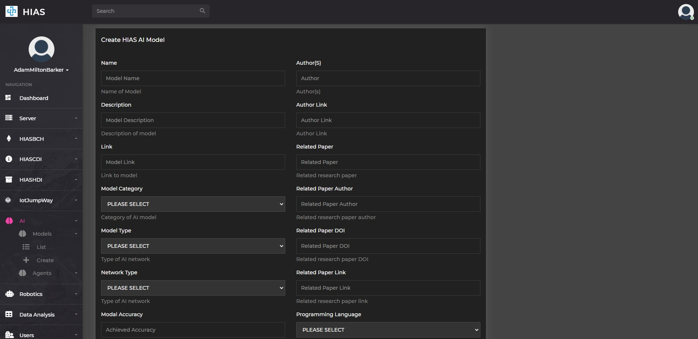
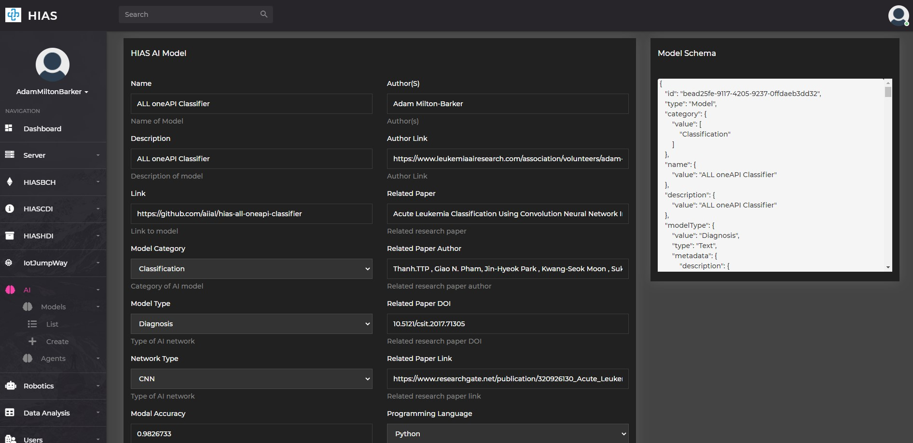
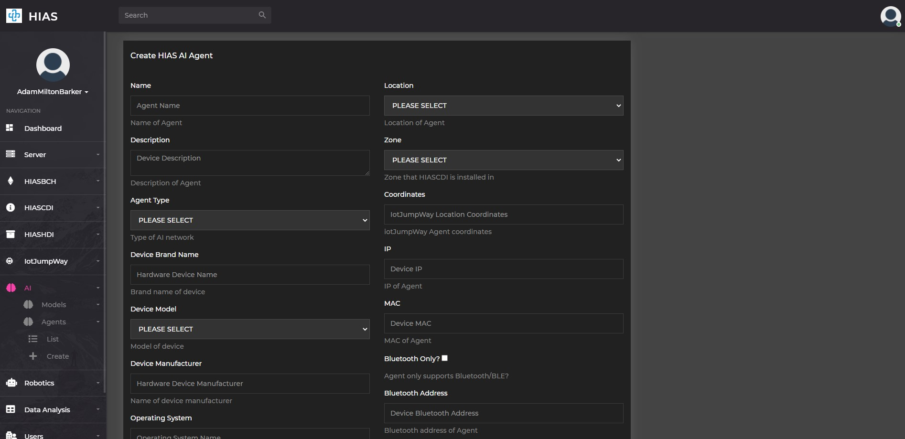
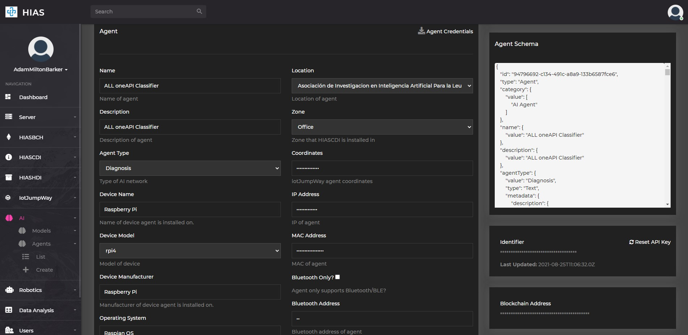

# Installation (Ubuntu)


# Introduction
This guide will take you through the installation process for the **HIAS Acute Lymphoblastic Leukemia oneAPI Classifier** on your Ubuntu development machine.

&nbsp;

# Prerequisites
You will need to ensure you have the following prerequisites installed and setup.

## Anaconda
If you haven't already installed Anaconda you will need to install it now. Follow the [Anaconda installation guide](https://docs.anaconda.com/anaconda/install/ "Anaconda installation guide") to do so.

## HIAS Core
For this project you will need a functioning [HIAS Core](https://github.com/aiial/hias-core). To install HIAS Core follow the [HIAS Core Installation Guide](https://hias-core.readthedocs.io/en/latest/installation/ubuntu/)

&nbsp;

# Intel® OneAPI MKL
First you will install Intel® OneAPI Math Kernal Lirary:

``` bash
conda create -n hias-all-oneapi-classifier python=3
conda activate hias-all-oneapi-classifier
conda install tensorflow -c anaconda
```

&nbsp;

# Intel® Distribution of OpenVINO™ Toolkit
Now you will install Intel® Distribution of OpenVINO™ Toolkit which will be used to convert your frozen model into an Intermediate Representation.

## Ubuntu 18.04

``` bash
conda install openvino-ie4py-ubuntu18 -c intel
conda install -c conda-forge defusedxml
pip3 install test-generator==0.1.1
```

## Ubuntu 20.04

``` bash
conda install openvino-ie4py-ubuntu20 -c intel
conda install -c conda-forge defusedxml
pip3 install test-generator==0.1.1
```

&nbsp;

# Clone the repository

Clone the [HIAS Acute Lymphoblastic Leukemia oneAPI Classifier](https://github.com/aiial/hias-all-oneapi-classifier " HIAS Acute Lymphoblastic Leukemia oneAPI Classifier") repository from the [Peter Moss MedTech Research Project](https://github.com/aiial "Peter Moss MedTech Research Project") Github Organization.

To clone the repository make sure you have Git installed. Now navigate to the a directory on your device using commandline, and then use the following command.

``` bash
 git clone https://github.com/aiial/hias-all-oneapi-classifier.git
```

Once you have used the command above you will see a directory called **hias-all-oneapi-classifier** in your home directory.

``` bash
 ls
```

Using the ls command in your home directory should show you the following.

``` bash
 hias-all-oneapi-classifier
```

Navigate to the **hias-all-oneapi-classifier** directory, this is your project root directory for this tutorial.

&nbsp;

# Installation File

All other software requirements are included in **scripts/install.sh**. You can run this file on your machine from the project root in terminal. Ensuring your `hias-all-oneapi-classifier` conda environment is active, use the commands that follow:

``` bash
 sh scripts/install.sh
```

If you receive any errors after running the above command, stop the installation and run the following commands:

``` bash
 sed -i 's/\r//' scripts/install.sh
 sh scripts/install.sh
```

&nbsp;

# HIAS

This device is a HIAS AI Agent and uses the HIAS MQTT Broker to communicate with the HIAS network. To setup an AI Agent on the HIAS network, head to the HIAS UI.

The HIAS network is powered by a context broker that stores contextual data and exposes the data securely to authenticated HIAS applications and devices.

Each HIAS AI Agent & AI Model has a JSON representation stored in the HIASCDI Context Broker that holds their contextual information.

## AI Model

A HIAS AI Model is a JSON representation of an Artificial Intelligence model used by the HIAS network.

First you need to set a HIAS AI Model up in the HIAS UI. Navigate to **AI->Models->Create** to create a HIAS AI Model. A future release of HIAS will provide the functionality to import the HIAS JSON representation of the AI Model, but for now you have to manually create the AI Model in the UI.



Once you have completed the form and submitted it, you can find the newly created AI Model by navigating to **AI->Models->List** and clicking on the relevant Model.

On the HIAS AI Model page you will be able to update the contextual data for the model, and also find the JSON representation.



## AI Agent

A HIAS AI Agent is a bridge between HIAS devices and applications, and HIAS IoT Agents. The AI Agents process incoming data by passing it through HIAS AI Models and returning the response back to the requesting device/application.

As with AI Models, AI Agents have an entry in the HIASCDI Context Broker and a JSON representation stored on the network.

You will now need to create your HIAS AI Agent and retrieve the credentials required by your Acute Lymphoblastic Leukemia oneAPI Classifier. Navigate to **AI->Agents->Create** to create a HIAS AI Model.



**MAKE SURE YOU SELECT THE PREVIOUSLY CREATED HIAS AI MODEL**

Once you have completed the form and submitted it, you can find the newly created AI Agent by navigating to **AI->Agents->List** and clicking on the relevant Agent.

On the HIAS AI Agent page you will be able to update the contextual data for the agent, and also find the JSON representation.



You now need to download the credentials required to connect the Acute Lymphoblastic Leukemia oneAPI Classifier to the HIAS network.

Click on the **Agent Credentials** button to download the credentials file. This should open your file browser, navigate to the **hias-all-oneapi-classifier/configuration/** directory and save the file as **credentials.json**.

&nbsp;

# Continue
Now you can continue with the Acute Lymphoblastic Leukemia oneAPI Classifier [usage guide](../usage/ubuntu.md) to train your model.

&nbsp;

# Contributing

The Peter Moss Acute Myeloid & Lymphoblastic Leukemia AI Research project encourages and youlcomes code contributions, bug fixes and enhancements from the Github.

Please read the [CONTRIBUTING](../../CONTRIBUTING.md "CONTRIBUTING") document for a full guide to forking our repositories and submitting your pull requests. You will also find information about our code of conduct on this page.

## Contributors

- [Adam Milton-Barker](https://www.leukemiaresearchassociation.ai/team/adam-milton-barker "Adam Milton-Barker") - [Asociacion De Investigacion En Inteligencia Artificial Para La Leucemia Peter Moss](https://www.leukemiaresearchassociation.ai "Asociacion De Investigacion En Inteligencia Artificial Para La Leucemia Peter Moss") President/Founder & Lead Developer, Sabadell, Spain

&nbsp;

# Versioning

You use SemVer for versioning. For the versions available, see [Releases](../../releases "Releases").

&nbsp;

# License

This project is licensed under the **MIT License** - see the [LICENSE](../../LICENSE "LICENSE") file for details.

&nbsp;

# Bugs/Issues

You use the [repo issues](../../issues "repo issues") to track bugs and general requests related to using this project. See [CONTRIBUTING](../../CONTRIBUTING.md "CONTRIBUTING") for more info on how to submit bugs, feature requests and proposals.