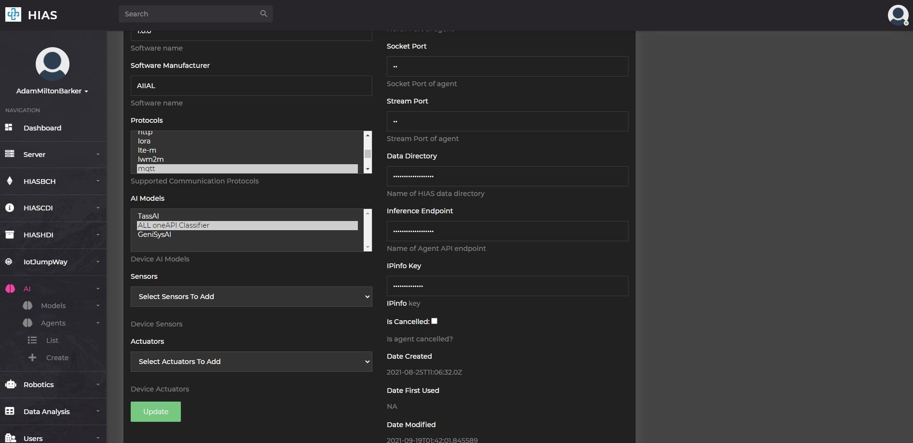
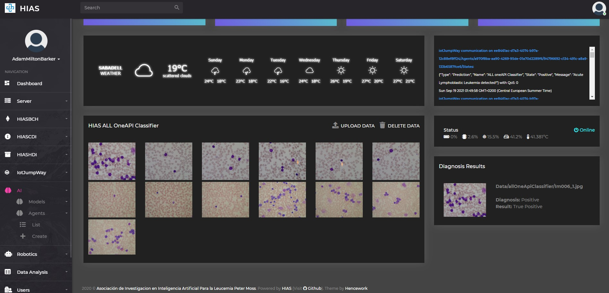

# Usage (Raspberry Pi)


# Introduction
This guide will take you through using the **HIAS Acute Lymphoblastic Leukemia oneAPI Classifier** on your Raspberry Pi 4.

&nbsp;

# Local Testing

Now you will test the classifier on your Raspberry Pi 4 using OpenVINO & Neural Compute Stick 2. You will use the 20 images that were removed from the training data during installation.

To run the AI Agent in test mode use the following command:

``` bash
python3 agent.py classify_openvino
```

You should see the application will start processing the test images and the results will be displayed in the console.

``` bash
2021-09-19 00:31:56,143 - Agent - INFO - Loaded test image model/data/test/Im099_0.jpg
2021-09-19 00:31:57,910 - Agent - INFO - Acute Lymphoblastic Leukemia correctly not detected (True Negative) in 1.7643792629241943 seconds.
2021-09-19 00:31:58,233 - Agent - INFO - Loaded test image model/data/test/Im047_0.jpg
2021-09-19 00:31:58,248 - Agent - INFO - Acute Lymphoblastic Leukemia correctly not detected (True Negative) in 0.013955831527709961 seconds.
2021-09-19 00:31:58,570 - Agent - INFO - Loaded test image model/data/test/Im106_0.jpg
2021-09-19 00:31:58,586 - Agent - INFO - Acute Lymphoblastic Leukemia correctly not detected (True Negative) in 0.013903617858886719 seconds.
2021-09-19 00:31:58,725 - Agent - INFO - Loaded test image model/data/test/Im020_1.jpg
2021-09-19 00:31:58,741 - Agent - INFO - Acute Lymphoblastic Leukemia correctly detected (True Positive) in 0.013935089111328125 seconds.
2021-09-19 00:31:59,036 - Agent - INFO - Loaded test image model/data/test/Im095_0.jpg
2021-09-19 00:31:59,051 - Agent - INFO - Acute Lymphoblastic Leukemia incorrectly detected (False Positive) in 0.01394963264465332 seconds.
2021-09-19 00:31:59,375 - Agent - INFO - Loaded test image model/data/test/Im053_1.jpg
2021-09-19 00:31:59,391 - Agent - INFO - Acute Lymphoblastic Leukemia incorrectly not detected (False Negative) in 0.013952493667602539 seconds.
2021-09-19 00:31:59,530 - Agent - INFO - Loaded test image model/data/test/Im024_1.jpg
2021-09-19 00:31:59,546 - Agent - INFO - Acute Lymphoblastic Leukemia correctly detected (True Positive) in 0.013888835906982422 seconds.
2021-09-19 00:31:59,866 - Agent - INFO - Loaded test image model/data/test/Im069_0.jpg
2021-09-19 00:31:59,882 - Agent - INFO - Acute Lymphoblastic Leukemia correctly not detected (True Negative) in 0.013928413391113281 seconds.
2021-09-19 00:32:00,201 - Agent - INFO - Loaded test image model/data/test/Im074_0.jpg
2021-09-19 00:32:00,217 - Agent - INFO - Acute Lymphoblastic Leukemia correctly not detected (True Negative) in 0.013946533203125 seconds.
2021-09-19 00:32:00,356 - Agent - INFO - Loaded test image model/data/test/Im006_1.jpg
2021-09-19 00:32:00,371 - Agent - INFO - Acute Lymphoblastic Leukemia correctly detected (True Positive) in 0.013928890228271484 seconds.
2021-09-19 00:32:00,694 - Agent - INFO - Loaded test image model/data/test/Im088_0.jpg
2021-09-19 00:32:00,710 - Agent - INFO - Acute Lymphoblastic Leukemia correctly not detected (True Negative) in 0.014078855514526367 seconds.
2021-09-19 00:32:01,032 - Agent - INFO - Loaded test image model/data/test/Im060_1.jpg
2021-09-19 00:32:01,061 - Agent - INFO - Acute Lymphoblastic Leukemia correctly detected (True Positive) in 0.013947486877441406 seconds.
2021-09-19 00:32:01,383 - Agent - INFO - Loaded test image model/data/test/Im101_0.jpg
2021-09-19 00:32:01,399 - Agent - INFO - Acute Lymphoblastic Leukemia correctly not detected (True Negative) in 0.01399540901184082 seconds.
2021-09-19 00:32:01,537 - Agent - INFO - Loaded test image model/data/test/Im031_1.jpg
2021-09-19 00:32:01,553 - Agent - INFO - Acute Lymphoblastic Leukemia correctly detected (True Positive) in 0.014025211334228516 seconds.
2021-09-19 00:32:01,874 - Agent - INFO - Loaded test image model/data/test/Im063_1.jpg
2021-09-19 00:32:01,889 - Agent - INFO - Acute Lymphoblastic Leukemia correctly detected (True Positive) in 0.014019250869750977 seconds.
2021-09-19 00:32:02,211 - Agent - INFO - Loaded test image model/data/test/Im035_0.jpg
2021-09-19 00:32:02,227 - Agent - INFO - Acute Lymphoblastic Leukemia correctly not detected (True Negative) in 0.014011383056640625 seconds.
2021-09-19 00:32:02,549 - Agent - INFO - Loaded test image model/data/test/Im057_1.jpg
2021-09-19 00:32:02,564 - Agent - INFO - Acute Lymphoblastic Leukemia correctly detected (True Positive) in 0.01399540901184082 seconds.
2021-09-19 00:32:02,886 - Agent - INFO - Loaded test image model/data/test/Im041_0.jpg
2021-09-19 00:32:02,902 - Agent - INFO - Acute Lymphoblastic Leukemia correctly not detected (True Negative) in 0.014095306396484375 seconds.
2021-09-19 00:32:03,041 - Agent - INFO - Loaded test image model/data/test/Im028_1.jpg
2021-09-19 00:32:03,057 - Agent - INFO - Acute Lymphoblastic Leukemia correctly detected (True Positive) in 0.013976573944091797 seconds.
2021-09-19 00:32:03,194 - Agent - INFO - Loaded test image model/data/test/Im026_1.jpg
2021-09-19 00:32:03,210 - Agent - INFO - Acute Lymphoblastic Leukemia correctly detected (True Positive) in 0.014018535614013672 seconds.
2021-09-19 00:32:03,210 - Agent - INFO - Images Classifier: 20
2021-09-19 00:32:03,210 - Agent - INFO - True Positives: 9
2021-09-19 00:32:03,211 - Agent - INFO - False Positives: 1
2021-09-19 00:32:03,211 - Agent - INFO - True Negatives: 9
2021-09-19 00:32:03,211 - Agent - INFO - False Negatives: 1
2021-09-19 00:32:03,211 - Agent - INFO - Total Time Taken: 2.0299320220947266
```

&nbsp;

# Server Testing

In the current terminal, now use the following command:

``` bash
python3 agent.py server_openvino
```

This will start the server on your Raspberry Pi that exposes the model via a REST API. Now open a new terminal, navigate to the project root and use the following command:

``` bash
python3 agent.py classify_openvino_http
```

This will start agent in HTTP Inference mode. The agent will loop through the testing data and send each image to the server for classification, the results are then displayed in the console.

``` bash
2021-09-19 00:42:25,855 - Agent - INFO - Sending request for: model/data/test/Im099_0.jpg
2021-09-19 00:42:28,952 - Agent - INFO - Acute Lymphoblastic Leukemia correctly detected (True Negative) in 3.096384048461914 seconds.
2021-09-19 00:42:28,959 - Agent - INFO - Sending request for: model/data/test/Im047_0.jpg
2021-09-19 00:42:30,313 - Agent - INFO - Acute Lymphoblastic Leukemia correctly detected (True Negative) in 1.3539931774139404 seconds.
2021-09-19 00:42:30,314 - Agent - INFO - Sending request for: model/data/test/Im106_0.jpg
2021-09-19 00:42:31,663 - Agent - INFO - Acute Lymphoblastic Leukemia correctly detected (True Negative) in 1.3494203090667725 seconds.
2021-09-19 00:42:31,663 - Agent - INFO - Sending request for: model/data/test/Im020_1.jpg
2021-09-19 00:42:32,334 - Agent - INFO - Acute Lymphoblastic Leukemia correctly detected (True Positive) in 0.671001672744751 seconds.
2021-09-19 00:42:32,335 - Agent - INFO - Sending request for: model/data/test/Im095_0.jpg
2021-09-19 00:42:33,590 - Agent - INFO - Acute Lymphoblastic Leukemia incorrectly detected (False Positive) in 1.255136251449585 seconds.
2021-09-19 00:42:33,590 - Agent - INFO - Sending request for: model/data/test/Im053_1.jpg
2021-09-19 00:42:34,948 - Agent - INFO - Acute Lymphoblastic Leukemia incorrectly detected (False Negative) in 1.357445478439331 seconds.
2021-09-19 00:42:34,948 - Agent - INFO - Sending request for: model/data/test/Im024_1.jpg
2021-09-19 00:42:35,589 - Agent - INFO - Acute Lymphoblastic Leukemia correctly detected (True Positive) in 0.6405436992645264 seconds.
2021-09-19 00:42:35,589 - Agent - INFO - Sending request for: model/data/test/Im069_0.jpg
2021-09-19 00:42:36,936 - Agent - INFO - Acute Lymphoblastic Leukemia correctly detected (True Negative) in 1.3462553024291992 seconds.
2021-09-19 00:42:36,936 - Agent - INFO - Sending request for: model/data/test/Im074_0.jpg
2021-09-19 00:42:38,276 - Agent - INFO - Acute Lymphoblastic Leukemia correctly detected (True Negative) in 1.3395044803619385 seconds.
2021-09-19 00:42:38,276 - Agent - INFO - Sending request for: model/data/test/Im006_1.jpg
2021-09-19 00:42:38,924 - Agent - INFO - Acute Lymphoblastic Leukemia correctly detected (True Positive) in 0.6482028961181641 seconds.
2021-09-19 00:42:38,924 - Agent - INFO - Sending request for: model/data/test/Im088_0.jpg
2021-09-19 00:42:40,274 - Agent - INFO - Acute Lymphoblastic Leukemia correctly detected (True Negative) in 1.3498878479003906 seconds.
2021-09-19 00:42:40,275 - Agent - INFO - Sending request for: model/data/test/Im060_1.jpg
2021-09-19 00:42:41,656 - Agent - INFO - Acute Lymphoblastic Leukemia correctly detected (True Positive) in 1.3813292980194092 seconds.
2021-09-19 00:42:41,657 - Agent - INFO - Sending request for: model/data/test/Im101_0.jpg
2021-09-19 00:42:43,043 - Agent - INFO - Acute Lymphoblastic Leukemia correctly detected (True Negative) in 1.3861136436462402 seconds.
2021-09-19 00:42:43,043 - Agent - INFO - Sending request for: model/data/test/Im031_1.jpg
2021-09-19 00:42:43,717 - Agent - INFO - Acute Lymphoblastic Leukemia correctly detected (True Positive) in 0.6737401485443115 seconds.
2021-09-19 00:42:43,717 - Agent - INFO - Sending request for: model/data/test/Im063_1.jpg
2021-09-19 00:42:45,064 - Agent - INFO - Acute Lymphoblastic Leukemia correctly detected (True Positive) in 1.347097396850586 seconds.
2021-09-19 00:42:45,072 - Agent - INFO - Sending request for: model/data/test/Im035_0.jpg
2021-09-19 00:42:46,423 - Agent - INFO - Acute Lymphoblastic Leukemia correctly detected (True Negative) in 1.35062575340271 seconds.
2021-09-19 00:42:46,423 - Agent - INFO - Sending request for: model/data/test/Im057_1.jpg
2021-09-19 00:42:47,769 - Agent - INFO - Acute Lymphoblastic Leukemia correctly detected (True Positive) in 1.3457365036010742 seconds.
2021-09-19 00:42:47,770 - Agent - INFO - Sending request for: model/data/test/Im041_0.jpg
2021-09-19 00:42:49,115 - Agent - INFO - Acute Lymphoblastic Leukemia correctly detected (True Negative) in 1.3452880382537842 seconds.
2021-09-19 00:42:49,115 - Agent - INFO - Sending request for: model/data/test/Im028_1.jpg
2021-09-19 00:42:49,787 - Agent - INFO - Acute Lymphoblastic Leukemia correctly detected (True Positive) in 0.6719515323638916 seconds.
2021-09-19 00:42:49,788 - Agent - INFO - Sending request for: model/data/test/Im026_1.jpg
2021-09-19 00:42:50,433 - Agent - INFO - Acute Lymphoblastic Leukemia correctly detected (True Positive) in 0.644808292388916 seconds.
2021-09-19 00:42:50,433 - Agent - INFO - Images Classified: 20
2021-09-19 00:42:50,433 - Agent - INFO - True Positives: 9
2021-09-19 00:42:50,433 - Agent - INFO - False Positives: 1
2021-09-19 00:42:50,434 - Agent - INFO - True Negatives: 9
2021-09-19 00:42:50,434 - Agent - INFO - False Negatives: 1
2021-09-19 00:42:50,434 - Agent - INFO - Total Time Taken: 24.554465770721436
```

&nbsp;

# HIAS UI

Now that your classifier is set up and running, you can interact with it via the HIAS UI, and from other HIAS integrated applications. Before you can do so there is a final step to take on your server.



Head to the AI Agent page for your classifier on HIAS **(AI->Agents->List->Your Agent)**. On the edit page you will see the **Inference Endpoint**, you need to copy that value.

## NGINX

Now in console open the NGINX config file:

``` bash
sudo nano /etc/nginx/sites-available/default
```

Find **ADD NEW ENDPOINTS AFTER THIS NOTICE**, and add the following, replacing **YourEndpoint** with your inference endpoint value, and  **YourIp/YourPort** with the IP/port of your Raspberry Pi.

``` bash
location ~ ^/AI/YourEndpoint/(.*)$ {
    auth_basic "Restricted";
    auth_basic_user_file /etc/nginx/security/htpasswd;
    proxy_pass http://YourIp:YourPort/$1;
}
```

Save the file and exit, then run the following command:

``` bash
sudo systemctl reload nginx
```

## Inference

Now you are set up to communicate with the HIASsAcute Lymphoblastic Leukemia oneAPI Classifier from the HIAS UI. Head to **(AI->Agents->List)** and then click on the **Diagnose** link on the relevant AI Agent.


Once on the inference UI upload the twenty test images. Now make sure the server is running on the RPI and click the data to send it to the Acute Lymphoblastic Leukemia oneAPI Classifier for classification.



### Verification

As we know from the filenames in advance whether an image is negative or positive, we can compare the classification with the file name to check if a classification is a true/false positive, or a true/false negative. In the Diagnosis Results area Diagnosis represents the classification provided by the Acute Lymphoblastic Leukemia oneAPI Classifier, and Result provides the verification result. You should get the same results as when testing earlier back in the tutorial. The UI should have one false negative and one false positive.

&nbsp;

# Compatible Projects
This classifier can power a number of HIAS compatible projects. Below are the direct links to the projects that are compatible with this classifier.

- [ALL Detection System For Oculus Rift](https://github.com/aiial/all-detection-system-for-oculus-rift)
- [ALL Detection System For Magic Leap 1](https://github.com/aiial/all-detection-system-for-magic-leap-1)

&nbsp;

# Contributing

The Peter Moss Acute Myeloid & Lymphoblastic Leukemia AI Research project encourages and youlcomes code contributions, bug fixes and enhancements from the Github.

Please read the [CONTRIBUTING](../../CONTRIBUTING.md "CONTRIBUTING") document for a full guide to forking our repositories and submitting your pull requests. You will also find information about our code of conduct on this page.

## Contributors

- [Adam Milton-Barker](https://www.leukemiaresearchassociation.ai/team/adam-milton-barker "Adam Milton-Barker") - [Asociacion De Investigacion En Inteligencia Artificial Para La Leucemia Peter Moss](https://www.leukemiaresearchassociation.ai "Asociacion De Investigacion En Inteligencia Artificial Para La Leucemia Peter Moss") President/Founder & Lead Developer, Sabadell, Spain

&nbsp;

# Versioning

You use SemVer for versioning. For the versions available, see [Releases](../../releases "Releases").

&nbsp;

# License

This project is licensed under the **MIT License** - see the [LICENSE](../../LICENSE "LICENSE") file for details.

&nbsp;

# Bugs/Issues

You use the [repo issues](../../issues "repo issues") to track bugs and general requests related to using this project. See [CONTRIBUTING](../../CONTRIBUTING.md "CONTRIBUTING") for more info on how to submit bugs, feature requests and proposals.