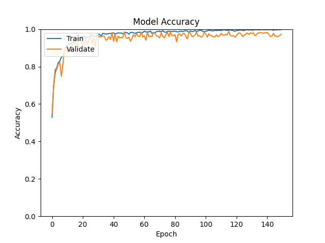
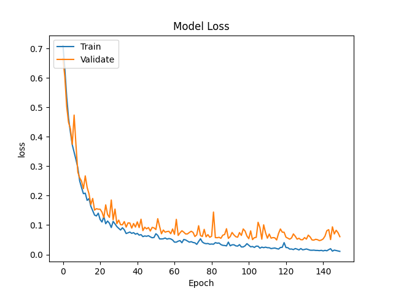
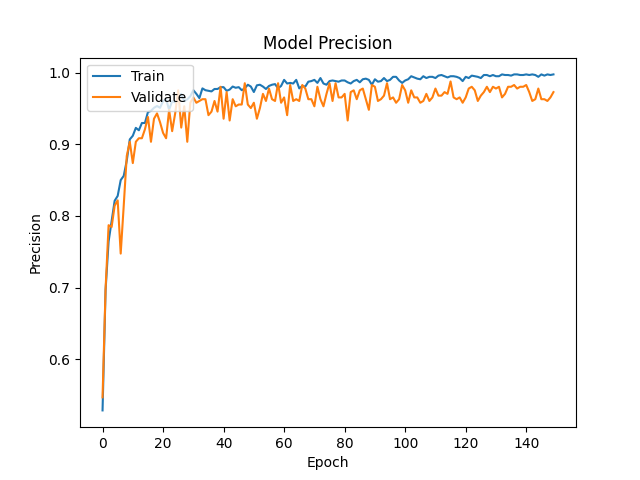
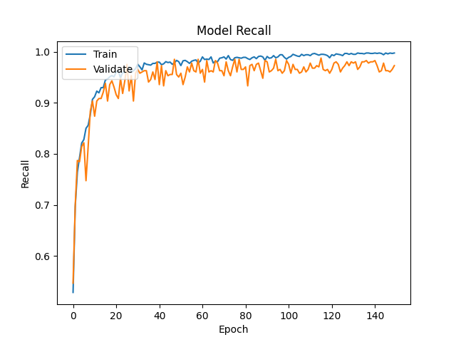
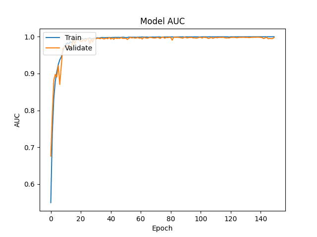
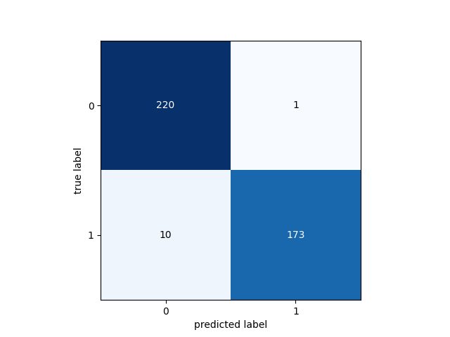

# Usage (Ubuntu)


# Introduction
This guide will take you through training the **HIAS Acute Lymphoblastic Leukemia oneAPI Classifier** on your Ubuntu development machine.

&nbsp;

# Installation
Make sure you have completed the [Ubuntu installation guide](../installation/ubuntu.md) before you continue with this tutorial.

&nbsp;

# Data
You need to be granted access to use the Acute Lymphoblastic Leukemia Image Database for Image Processing dataset. You can find the application form and information about getting access to the dataset on [this page](https://homes.di.unimi.it/scotti/all/#download) as well as information on how to contribute back to the project [here](https://homes.di.unimi.it/scotti/all/results.php).

Once you have your data you need to add it to the project filesystem. You will notice the data folder in the `model` directory, **model/data**, inside you have **train** & **test**. Add all of the images from the ALL_IDB1 dataset to the **model/data/train** folder.

## Application testing data

In the data processing stage, ten negative images and ten positive images are removed from the dataset and moved to the **model/data/test/** directory. This data is not seen by the network during the training process, and is used for testing and by related applications.

To ensure your model gets the same results, please use the same test images. By default HIAS compatible projects will be expecting the same test images.  You can also try with your own image selection, however results may vary and you will need to make additional changes to our HIAS compatible projects.

To specify which test images to use modify the [configuration/config.json](../../configuration/config.json) file as shown below:

```
"test_data": [
	"im006_1.jpg",
	"im020_1.jpg",
	"im024_1.jpg",
	"im026_1.jpg",
	"im028_1.jpg",
	"im031_1.jpg",
	"im035_0.jpg",
	"im041_0.jpg",
	"im047_0.jpg",
	"im053_1.jpg",
	"im057_1.jpg",
	"im060_1.jpg",
	"im063_1.jpg",
	"im069_0.jpg",
	"im074_0.jpg",
	"im088_0.jpg",
	"im095_0.jpg",
	"im099_0.jpg",
	"im101_0.jpg",
	"im106_0.jpg"
],
```

&nbsp;

# Training
Now you are ready to train your model. Ensuring you are in the project root and the `hias-all-oneapi-classifier` conda environment is activated, run the following command:

``` bash
python3 agent.py train
```

First the training and validation data will be prepared. At the end of this stage you will see the following output:

``` bash
2021-09-18 21:49:44,700 - Agent - INFO - Data shape: (1584, 100, 100, 3)
2021-09-18 21:49:44,701 - Agent - INFO - Labels shape: (1584, 2)
2021-09-18 21:49:44,701 - Agent - INFO - Raw data: 792
2021-09-18 21:49:44,701 - Agent - INFO - Raw negative data: 441
2021-09-18 21:49:44,701 - Agent - INFO - Raw positive data: 351
2021-09-18 21:49:44,701 - Agent - INFO - Augmented data: (1584, 100, 100, 3)
2021-09-18 21:49:44,701 - Agent - INFO - Labels: (1584, 2)
2021-09-18 21:49:44,923 - Agent - INFO - Training data: (1180, 100, 100, 3)
2021-09-18 21:49:44,923 - Agent - INFO - Training labels: (1180, 2)
2021-09-18 21:49:44,923 - Agent - INFO - Validation data: (404, 100, 100, 3)
2021-09-18 21:49:44,923 - Agent - INFO - Validation labels: (404, 2)
2021-09-18 21:49:44,925 - Agent - INFO - Data preperation complete.
```

Next you will see the model summary:

``` bash
Model: "AllOneApiClassifier"
_________________________________________________________________
Layer (type)                 Output Shape              Param #
=================================================================
zero_padding2d (ZeroPadding2 (None, 104, 104, 3)       0
_________________________________________________________________
conv2d (Conv2D)              (None, 100, 100, 30)      2280
_________________________________________________________________
zero_padding2d_1 (ZeroPaddin (None, 104, 104, 30)      0
_________________________________________________________________
conv2d_1 (Conv2D)            (None, 100, 100, 30)      22530
_________________________________________________________________
max_pooling2d (MaxPooling2D) (None, 50, 50, 30)        0
_________________________________________________________________
flatten (Flatten)            (None, 75000)             0
_________________________________________________________________
dense (Dense)                (None, 2)                 150002
_________________________________________________________________
activation (Activation)      (None, 2)                 0
=================================================================
Total params: 174,812
Trainable params: 174,812
Non-trainable params: 0
_________________________________________________________________
```

And finally the model will begin training.

&nbsp;

# Results
Below you will find the training results for 150 epochs.

## Training Output

``` bash
2021-09-19 00:02:28,030 - Agent - INFO - Metrics: loss 0.060633027169964104
2021-09-19 00:02:28,030 - Agent - INFO - Metrics: acc 0.9727723
2021-09-19 00:02:28,030 - Agent - INFO - Metrics: precision 0.9727723
2021-09-19 00:02:28,030 - Agent - INFO - Metrics: recall 0.9727723
2021-09-19 00:02:28,031 - Agent - INFO - Metrics: auc 0.9978372

2021-09-19 00:02:28,752 - Agent - INFO - Confusion Matrix: [[220   1] [ 10 173]]

2021-09-19 00:02:28,861 - Agent - INFO - True Positives: 173(42.82178217821782%)
2021-09-19 00:02:28,861 - Agent - INFO - False Positives: 1(0.24752475247524752%)
2021-09-19 00:02:28,861 - Agent - INFO - True Negatives: 220(54.45544554455446%)
2021-09-19 00:02:28,861 - Agent - INFO - False Negatives: 10(2.4752475247524752%)
2021-09-19 00:02:28,861 - Agent - INFO - Specificity: 0.995475113122172
2021-09-19 00:02:28,862 - Agent - INFO - Misclassification: 11(2.722772277227723%)
```

## Metrics Overview
| Accuracy | Recall | Precision | AUC/ROC |
| ---------- | ---------- | ---------- | ---------- |
| 0.9727723 | 0.9727723 | 0.9727723 | 0.9978372 |

## ALL-IDB Required Metrics
| Figures of merit     | Amount/Value | Percentage |
| -------------------- | ----- | ---------- |
| True Positives       | 173 | 42.82178217821782% |
| False Positives      | 1 | 0.24752475247524752% |
| True Negatives       | 220 | 54.45544554455446% |
| False Negatives      | 10 | 2.4752475247524752% |
| Misclassification    | 11 | 2.722772277227723% |
| Sensitivity / Recall | 0.9727723   | 0.97% |
| Specificity          | 0.995475113122172  | 100% |

## Metrics Plots



_Fig 1. Accuracy_



_Fig 2. Loss_



_Fig 3. Precision_



_Fig 4. Recall_



_Fig 5. AUC_



_Fig 6. Confusion Matrix_

&nbsp;

# Testing

Now you will test the classifier on your development machine. You will use the 20 images that were removed from the training data in a previous part of this tutorial.

To run the AI Agent in test mode use the following command:

```
python3 agent.py classify
```

You should see the following which shows you the network architecture:

```
Model: "AllOneApiClassifier"
_________________________________________________________________
Layer (type)                 Output Shape              Param #
=================================================================
zero_padding2d (ZeroPadding2 (None, 104, 104, 3)       0
_________________________________________________________________
conv2d (Conv2D)              (None, 100, 100, 30)      2280
_________________________________________________________________
zero_padding2d_1 (ZeroPaddin (None, 104, 104, 30)      0
_________________________________________________________________
conv2d_1 (Conv2D)            (None, 100, 100, 30)      22530
_________________________________________________________________
max_pooling2d (MaxPooling2D) (None, 50, 50, 30)        0
_________________________________________________________________
flatten (Flatten)            (None, 75000)             0
_________________________________________________________________
dense (Dense)                (None, 2)                 150002
_________________________________________________________________
activation (Activation)      (None, 2)                 0
=================================================================
Total params: 174,812
Trainable params: 174,812
Non-trainable params: 0
```

Finally the application will start processing the test images and the results will be displayed in the console.

``` bash
2021-09-19 00:03:34,593 - Agent - INFO - Acute Lymphoblastic Leukemia correctly detected (True Positive) in 0.15274596214294434 seconds.
2021-09-19 00:03:34,629 - Agent - INFO - Loaded test image model/data/test/Im028_1.jpg
2021-09-19 00:03:34,636 - Agent - INFO - Acute Lymphoblastic Leukemia correctly detected (True Positive) in 0.04251694679260254 seconds.
2021-09-19 00:03:34,713 - Agent - INFO - Loaded test image model/data/test/Im106_0.jpg
2021-09-19 00:03:34,720 - Agent - INFO - Acute Lymphoblastic Leukemia correctly not detected (True Negative) in 0.0836799144744873 seconds.
2021-09-19 00:03:34,795 - Agent - INFO - Loaded test image model/data/test/Im101_0.jpg
2021-09-19 00:03:34,802 - Agent - INFO - Acute Lymphoblastic Leukemia correctly not detected (True Negative) in 0.08228707313537598 seconds.
2021-09-19 00:03:34,834 - Agent - INFO - Loaded test image model/data/test/Im024_1.jpg
2021-09-19 00:03:34,841 - Agent - INFO - Acute Lymphoblastic Leukemia correctly detected (True Positive) in 0.038298606872558594 seconds.
2021-09-19 00:03:34,914 - Agent - INFO - Loaded test image model/data/test/Im074_0.jpg
2021-09-19 00:03:34,921 - Agent - INFO - Acute Lymphoblastic Leukemia correctly not detected (True Negative) in 0.08018183708190918 seconds.
2021-09-19 00:03:34,996 - Agent - INFO - Loaded test image model/data/test/Im035_0.jpg
2021-09-19 00:03:35,003 - Agent - INFO - Acute Lymphoblastic Leukemia correctly not detected (True Negative) in 0.0811767578125 seconds.
2021-09-19 00:03:35,034 - Agent - INFO - Loaded test image model/data/test/Im006_1.jpg
2021-09-19 00:03:35,041 - Agent - INFO - Acute Lymphoblastic Leukemia correctly detected (True Positive) in 0.03841996192932129 seconds.
2021-09-19 00:03:35,073 - Agent - INFO - Loaded test image model/data/test/Im020_1.jpg
2021-09-19 00:03:35,079 - Agent - INFO - Acute Lymphoblastic Leukemia correctly detected (True Positive) in 0.03810429573059082 seconds.
2021-09-19 00:03:35,147 - Agent - INFO - Loaded test image model/data/test/Im095_0.jpg
2021-09-19 00:03:35,154 - Agent - INFO - Acute Lymphoblastic Leukemia correctly not detected (True Negative) in 0.07399249076843262 seconds.
2021-09-19 00:03:35,228 - Agent - INFO - Loaded test image model/data/test/Im069_0.jpg
2021-09-19 00:03:35,235 - Agent - INFO - Acute Lymphoblastic Leukemia correctly not detected (True Negative) in 0.08146858215332031 seconds.
2021-09-19 00:03:35,267 - Agent - INFO - Loaded test image model/data/test/Im031_1.jpg
2021-09-19 00:03:35,274 - Agent - INFO - Acute Lymphoblastic Leukemia correctly detected (True Positive) in 0.03837895393371582 seconds.
2021-09-19 00:03:35,348 - Agent - INFO - Loaded test image model/data/test/Im099_0.jpg
2021-09-19 00:03:35,355 - Agent - INFO - Acute Lymphoblastic Leukemia correctly not detected (True Negative) in 0.08129477500915527 seconds.
2021-09-19 00:03:35,387 - Agent - INFO - Loaded test image model/data/test/Im026_1.jpg
2021-09-19 00:03:35,394 - Agent - INFO - Acute Lymphoblastic Leukemia correctly detected (True Positive) in 0.03829550743103027 seconds.
2021-09-19 00:03:35,468 - Agent - INFO - Loaded test image model/data/test/Im057_1.jpg
2021-09-19 00:03:35,475 - Agent - INFO - Acute Lymphoblastic Leukemia correctly detected (True Positive) in 0.08077669143676758 seconds.
2021-09-19 00:03:35,550 - Agent - INFO - Loaded test image model/data/test/Im088_0.jpg
2021-09-19 00:03:35,557 - Agent - INFO - Acute Lymphoblastic Leukemia correctly not detected (True Negative) in 0.08171367645263672 seconds.
2021-09-19 00:03:35,632 - Agent - INFO - Loaded test image model/data/test/Im060_1.jpg
2021-09-19 00:03:35,638 - Agent - INFO - Acute Lymphoblastic Leukemia incorrectly not detected (False Negative) in 0.08168196678161621 seconds.
2021-09-19 00:03:35,713 - Agent - INFO - Loaded test image model/data/test/Im053_1.jpg
2021-09-19 00:03:35,720 - Agent - INFO - Acute Lymphoblastic Leukemia incorrectly not detected (False Negative) in 0.08159828186035156 seconds.
2021-09-19 00:03:35,794 - Agent - INFO - Loaded test image model/data/test/Im041_0.jpg
2021-09-19 00:03:35,801 - Agent - INFO - Acute Lymphoblastic Leukemia correctly not detected (True Negative) in 0.08086276054382324 seconds.
2021-09-19 00:03:35,876 - Agent - INFO - Loaded test image model/data/test/Im047_0.jpg
2021-09-19 00:03:35,883 - Agent - INFO - Acute Lymphoblastic Leukemia correctly not detected (True Negative) in 0.08133721351623535 seconds.
2021-09-19 00:03:35,883 - Agent - INFO - Images Classified: 20
2021-09-19 00:03:35,883 - Agent - INFO - True Positives: 8
2021-09-19 00:03:35,883 - Agent - INFO - False Positives: 0
2021-09-19 00:03:35,883 - Agent - INFO - True Negatives: 10
2021-09-19 00:03:35,883 - Agent - INFO - False Negatives: 2
2021-09-19 00:03:35,883 - Agent - INFO - Total Time Taken: 1.438812255859375
```

In the current terminal, now use the following command:

```
python3 agent.py server
```

This will start the server on your training machine that exposes the model via a REST API. Now open a new terminal, navigate to the project root and use the following command:

```
python3 agent.py classify_http
```

This will start agent in HTTP Inference mode. The agent will loop through the testing data and send each image to the server for classification, the results are then displayed in the console.

``` bash
2021-09-19 00:43:54,697 - Agent - INFO - Sending request for: model/data/test/Im063_1.jpg
2021-09-19 00:43:54,995 - Agent - INFO - Acute Lymphoblastic Leukemia correctly detected (True Positive) in 0.2976648807525635 seconds.
2021-09-19 00:43:54,995 - Agent - INFO - Sending request for: model/data/test/Im028_1.jpg
2021-09-19 00:43:55,110 - Agent - INFO - Acute Lymphoblastic Leukemia correctly detected (True Positive) in 0.11492085456848145 seconds.
2021-09-19 00:43:55,110 - Agent - INFO - Sending request for: model/data/test/Im106_0.jpg
2021-09-19 00:43:55,334 - Agent - INFO - Acute Lymphoblastic Leukemia correctly detected (True Negative) in 0.22387242317199707 seconds.
2021-09-19 00:43:55,334 - Agent - INFO - Sending request for: model/data/test/Im101_0.jpg
2021-09-19 00:43:55,557 - Agent - INFO - Acute Lymphoblastic Leukemia correctly detected (True Negative) in 0.22250127792358398 seconds.
2021-09-19 00:43:55,557 - Agent - INFO - Sending request for: model/data/test/Im024_1.jpg
2021-09-19 00:43:55,660 - Agent - INFO - Acute Lymphoblastic Leukemia correctly detected (True Positive) in 0.10355067253112793 seconds.
2021-09-19 00:43:55,660 - Agent - INFO - Sending request for: model/data/test/Im074_0.jpg
2021-09-19 00:43:55,879 - Agent - INFO - Acute Lymphoblastic Leukemia correctly detected (True Negative) in 0.21893024444580078 seconds.
2021-09-19 00:43:55,879 - Agent - INFO - Sending request for: model/data/test/Im035_0.jpg
2021-09-19 00:43:56,111 - Agent - INFO - Acute Lymphoblastic Leukemia correctly detected (True Negative) in 0.231856107711792 seconds.
2021-09-19 00:43:56,111 - Agent - INFO - Sending request for: model/data/test/Im006_1.jpg
2021-09-19 00:43:56,214 - Agent - INFO - Acute Lymphoblastic Leukemia correctly detected (True Positive) in 0.10265469551086426 seconds.
2021-09-19 00:43:56,214 - Agent - INFO - Sending request for: model/data/test/Im020_1.jpg
2021-09-19 00:43:56,315 - Agent - INFO - Acute Lymphoblastic Leukemia correctly detected (True Positive) in 0.1011204719543457 seconds.
2021-09-19 00:43:56,315 - Agent - INFO - Sending request for: model/data/test/Im095_0.jpg
2021-09-19 00:43:56,519 - Agent - INFO - Acute Lymphoblastic Leukemia correctly detected (True Negative) in 0.20377898216247559 seconds.
2021-09-19 00:43:56,519 - Agent - INFO - Sending request for: model/data/test/Im069_0.jpg
2021-09-19 00:43:56,742 - Agent - INFO - Acute Lymphoblastic Leukemia correctly detected (True Negative) in 0.22292089462280273 seconds.
2021-09-19 00:43:56,742 - Agent - INFO - Sending request for: model/data/test/Im031_1.jpg
2021-09-19 00:43:56,845 - Agent - INFO - Acute Lymphoblastic Leukemia correctly detected (True Positive) in 0.10294127464294434 seconds.
2021-09-19 00:43:56,845 - Agent - INFO - Sending request for: model/data/test/Im099_0.jpg
2021-09-19 00:43:57,067 - Agent - INFO - Acute Lymphoblastic Leukemia correctly detected (True Negative) in 0.2218623161315918 seconds.
2021-09-19 00:43:57,067 - Agent - INFO - Sending request for: model/data/test/Im026_1.jpg
2021-09-19 00:43:57,171 - Agent - INFO - Acute Lymphoblastic Leukemia correctly detected (True Positive) in 0.10353922843933105 seconds.
2021-09-19 00:43:57,171 - Agent - INFO - Sending request for: model/data/test/Im057_1.jpg
2021-09-19 00:43:57,394 - Agent - INFO - Acute Lymphoblastic Leukemia correctly detected (True Positive) in 0.2229921817779541 seconds.
2021-09-19 00:43:57,394 - Agent - INFO - Sending request for: model/data/test/Im088_0.jpg
2021-09-19 00:43:57,618 - Agent - INFO - Acute Lymphoblastic Leukemia correctly detected (True Negative) in 0.22388410568237305 seconds.
2021-09-19 00:43:57,618 - Agent - INFO - Sending request for: model/data/test/Im060_1.jpg
2021-09-19 00:43:57,841 - Agent - INFO - Acute Lymphoblastic Leukemia incorrectly detected (False Negative) in 0.22273635864257812 seconds.
2021-09-19 00:43:57,841 - Agent - INFO - Sending request for: model/data/test/Im053_1.jpg
2021-09-19 00:43:58,066 - Agent - INFO - Acute Lymphoblastic Leukemia incorrectly detected (False Negative) in 0.22502851486206055 seconds.
2021-09-19 00:43:58,066 - Agent - INFO - Sending request for: model/data/test/Im041_0.jpg
2021-09-19 00:43:58,290 - Agent - INFO - Acute Lymphoblastic Leukemia correctly detected (True Negative) in 0.2235252857208252 seconds.
2021-09-19 00:43:58,290 - Agent - INFO - Sending request for: model/data/test/Im047_0.jpg
2021-09-19 00:43:58,512 - Agent - INFO - Acute Lymphoblastic Leukemia correctly detected (True Negative) in 0.2222459316253662 seconds.
2021-09-19 00:43:58,512 - Agent - INFO - Images Classified: 20
2021-09-19 00:43:58,512 - Agent - INFO - True Positives: 8
2021-09-19 00:43:58,512 - Agent - INFO - False Positives: 0
2021-09-19 00:43:58,513 - Agent - INFO - True Negatives: 10
2021-09-19 00:43:58,513 - Agent - INFO - False Negatives: 2
2021-09-19 00:43:58,513 - Agent - INFO - Total Time Taken: 3.8125267028808594
```

# OpenVINO Intermediate Representation

Finally you need to convert your frozen model to an Intermediate Representation. To do this, use the following command, replacing **YourProjectPath** with the path to your project home.

```
python3 /opt/intel/openvino_2021/deployment_tools/model_optimizer/mo_tf.py --input_model /YourProjectPath/hias-all-oneapi-classifier/model/freezing/frozen.pb --input_shape [1,100,100,3] --output_dir /YourProjectPath/hias-all-oneapi-classifier/model/ir --reverse_input_channels --generate_deprecated_IR_V7
```

If all has been successful you should see the following output:

``` bash
[ SUCCESS ] Generated IR version 10 model.
[ SUCCESS ] XML file: /YourProjectPath/hias-all-oneapi-classifier/model/ir/frozen.xml
[ SUCCESS ] BIN file: /YourProjectPath/hias-all-oneapi-classifier/model/ir/frozen.bin
[ SUCCESS ] Total execution time: 2.13 seconds.
[ SUCCESS ] Memory consumed: 245 MB.
```

&nbsp;

# Continue
Now you can continue with the Acute Lymphoblastic Leukemia oneAPI Classifier [Raspberry Pi installation guide](../installation/raspberry-pi.md) to set up your Rasperry Pi.

&nbsp;

# Contributing

The Peter Moss Acute Myeloid & Lymphoblastic Leukemia AI Research project encourages and youlcomes code contributions, bug fixes and enhancements from the Github.

Please read the [CONTRIBUTING](../../CONTRIBUTING.md "CONTRIBUTING") document for a full guide to forking our repositories and submitting your pull requests. You will also find information about our code of conduct on this page.

## Contributors

- [Adam Milton-Barker](https://www.leukemiaresearchassociation.ai/team/adam-milton-barker "Adam Milton-Barker") - [Asociacion De Investigacion En Inteligencia Artificial Para La Leucemia Peter Moss](https://www.leukemiaresearchassociation.ai "Asociacion De Investigacion En Inteligencia Artificial Para La Leucemia Peter Moss") President/Founder & Lead Developer, Sabadell, Spain

&nbsp;

# Versioning

You use SemVer for versioning. For the versions available, see [Releases](../../releases "Releases").

&nbsp;

# License

This project is licensed under the **MIT License** - see the [LICENSE](../../LICENSE "LICENSE") file for details.

&nbsp;

# Bugs/Issues

You use the [repo issues](../../issues "repo issues") to track bugs and general requests related to using this project. See [CONTRIBUTING](../../CONTRIBUTING.md "CONTRIBUTING") for more info on how to submit bugs, feature requests and proposals.