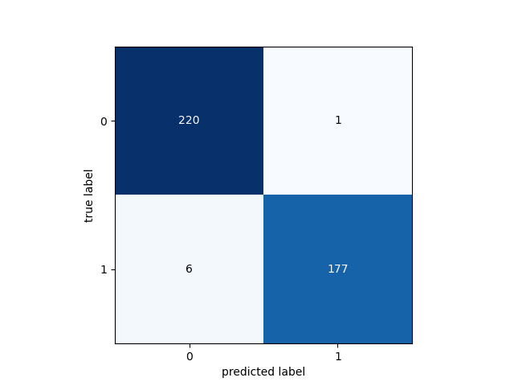

# Asociación de Investigacion en Inteligencia Artificial Para la Leucemia Peter Moss
## Acute Lymphoblastic Leukemia oneAPI Classifier
### Getting Started


&nbsp;

# Table Of Contents

- [Introduction](#introduction)
    - [Network Architecture](#network-architecture)
- [Installation](#installation)
- [Data](#data)
	- [Data Augmentation](#data-augmentation)
	- [Application Testing Data](#application-testing-data)
- [Configuration](#configuration)
- [Training](#training)
    - [Metrics](#metrics)
	- [Start Training](#start-training)
	- [Training Data](#training-data)
	- [Model Summary](#model-summary)
	- [Training Results](#training-results)
	- [Metrics Overview](#metrics-overview)
	- [ALL-IDB Required Metrics](#all-idb-required-metrics)
- [Testing](#testing)
- [OpenVINO Intermediate Representation](#openvino-intermediate-representation)
- [Raspberry Pi 4](#raspberry-pi-4)
    - [Raspberry Pi OS](#raspberry-pi-os)
    - [Intel® Distribution of OpenVINO™ Toolkit](#intel-distribution-of-openvino-toolkit)
    - [Intel® Movidius™ Neural Compute Stick 2](#intel-movidius-neural-compute-stick-2)
    - [Software Install](#software-install)
    - [Local Testing](#local-testing)
- [Contributing](#contributing)
  - [Contributors](#contributors)
- [Versioning](#versioning)
- [License](#license)
- [Bugs/Issues](#bugs-issues)

&nbsp;

# Introduction
This guide will guide you through the installation process for the Acute Lymphoblastic Leukemia oneAPI Classifier.

## Network Architecture
You will build a Convolutional Neural Network based on the proposed architecture in [Acute Leukemia Classification Using Convolution Neural Network In Clinical Decision Support System](https://airccj.org/CSCP/vol7/csit77505.pdf "Acute Leukemia Classification Using Convolution Neural Network In Clinical Decision Support System"). The network will consist of the following 5 layers (missing out the zero padding layers). Note you are usng an conv sizes of (100x100x30) whereas in the paper, the authors use (50x50x30).

- Conv layer (100x100x30)
- Conv layer (100x100x30)
- Max-Pooling layer (50x50x30)
- Fully Connected layer (2 neurons)
- Softmax layer (Output 2)

&nbsp;

# Installation
First you need to install the required software for training the model. Below are the available installation guides:

- [Ubuntu installation guide](installation/ubuntu.md) (Training).
- [Raspberry Pi 4 installation guide](installation/rpi4.md) (Inference on the edge).

&nbsp;

# Data
You need to be granted access to use the Acute Lymphoblastic Leukemia Image Database for Image Processing dataset. You can find the application form and information about getting access to the dataset on [this page](https://homes.di.unimi.it/scotti/all/#download) as well as information on how to contribute back to the project [here](https://homes.di.unimi.it/scotti/all/results.php).

_If you are not able to obtain a copy of the dataset please feel free to try this tutorial on your own dataset._

Once you have your data you need to add it to the project filesystem. You will notice the data folder in the Model directory, **model/data**, inside you have **train** & **test**. Add all of the images from the ALL_IDB1 dataset to the **model/data/train** folder.

## Data Augmentation

You will create an augmented dataset based on the [Leukemia Blood Cell Image Classification Using Convolutional Neural Network](http://www.ijcte.org/vol10/1198-H0012.pdf "Leukemia Blood Cell Image Classification Using Convolutional Neural Network") by T. T. P. Thanh, Caleb Vununu, Sukhrob Atoev, Suk-Hwan Lee, and Ki-Ryong Kwon. In this case, you will use more rotated images to increase the dataset further.

## Application testing data

In the data processing stage, ten negative images and ten positive images are removed from the dataset and moved to the **model/data/test/** directory. This data is not seen by the network during the training process, and is used by applications.

To ensure your model gets the same results, please use the same test images. By default HIAS compatible projects will be expecting the same test images.  You can also try with your own image selection, however results may vary and you will need to make additional changes to our HIAS compatible projects.

To specify which test images to use modify the [configuration/config.json](../configuration/config.json) file as shown below:

```
"test_data": [
	"im006_1.jpg",
	"im020_1.jpg",
	"im024_1.jpg",
	"im026_1.jpg",
	"im028_1.jpg",
	"im031_1.jpg",
	"im035_0.jpg",
	"im041_0.jpg",
	"im047_0.jpg",
	"im053_1.jpg",
	"im057_1.jpg",
	"im060_1.jpg",
	"im063_1.jpg",
	"im069_0.jpg",
	"im074_0.jpg",
	"im088_0.jpg",
	"im095_0.jpg",
	"im099_0.jpg",
	"im101_0.jpg",
	"im106_0.jpg"
],
```

&nbsp;

# Configuration
[configuration/config.json](../configuration/config.json "configuration/config.json")  holds the configuration for our application.

- Change **agent->cores** to the number of cores you have on your training computer.
- Change **agent->server** to the local IP of your training device.
- Change **agent->port** to a different number.

```
{
    "agent": {
        "cores": 8,
        "server": "",
        "port": 1234,
        "params": [
            "train",
            "classify",
            "server",
            "classify_http"
        ]
    },
    "data": {
        "dim": 100,
        "file_type": ".jpg",
        "labels": [0, 1],
        "rotations": 10,
        "seed": 2,
        "split": 0.3,
        "test": "model/data/test",
        "test_data": [
            "Im006_1.jpg",
            "Im020_1.jpg",
            "Im024_1.jpg",
            "Im026_1.jpg",
            "Im028_1.jpg",
            "Im031_1.jpg",
            "Im035_0.jpg",
            "Im041_0.jpg",
            "Im047_0.jpg",
            "Im053_1.jpg",
            "Im057_1.jpg",
            "Im060_1.jpg",
            "Im063_1.jpg",
            "Im069_0.jpg",
            "Im074_0.jpg",
            "Im088_0.jpg",
            "Im095_0.jpg",
            "Im099_0.jpg",
            "Im101_0.jpg",
            "Im106_0.jpg"
        ],
        "train_dir": "model/data/train",
        "valid_types": [
            ".JPG",
            ".JPEG",
            ".PNG",
            ".GIF",
            ".jpg",
            ".jpeg",
            ".png",
            ".gif"
        ]
    },
    "model": {
        "device": "CPU",
        "freezing_log_dir": "model/freezing",
        "frozen": "frozen.pb",
        "ir": "model/ir/frozen.xml",
        "model": "model/model.json",
        "saved_model_dir": "model",
        "weights": "model/weights.h5"
    },
    "train": {
        "batch": 100,
        "decay_adam": 1e-6,
        "epochs": 150,
        "learning_rate_adam": 1e-4,
        "val_steps": 10
    }
}
```

The configuration object contains 4 Json Objects (agent, data, model and train). Agent has the information used to set up your server, data has the configuration related to preparing the training and validation data, model holds the model file paths, and train holds the training parameters.

&nbsp;

# Training
Now you are ready to train your model.

## Metrics
We can use metrics to measure the effectiveness of our model. In this network you will use the following metrics:

```
tf.keras.metrics.BinaryAccuracy(name='accuracy'),
tf.keras.metrics.Precision(name='precision'),
tf.keras.metrics.Recall(name='recall'),
tf.keras.metrics.AUC(name='auc')
```

These metrics will be displayed and plotted once our model is trained.  A useful tutorial while working on the metrics was the [Classification on imbalanced data](https://www.tensorflow.org/tutorials/structured_data/imbalanced_data) tutorial on Tensorflow's website.

## Start Training
Ensuring you have completed all previous steps, you can start training using the following command.

```
python agent.py train
```

This tells the application to start training the model.

## Training Data
First the training and validation data will be prepared.

```
2021-05-02 18: 43: 57, 164 - Agent - INFO - Data shape: (1584, 100, 100, 3)
2021-05-02 18: 43: 57, 165 - Agent - INFO - Labels shape: (1584, 2)
2021-05-02 18: 43: 57, 165 - Agent - INFO - Raw data: 792
2021-05-02 18: 43: 57, 165 - Agent - INFO - Raw negative data: 441
2021-05-02 18: 43: 57, 166 - Agent - INFO - Raw positive data: 351
2021-05-02 18: 43: 57, 166 - Agent - INFO - Augmented data: (1584, 100, 100, 3)
2021-05-02 18: 43: 57, 166 - Agent - INFO - Labels: (1584, 2)
2021-05-02 18: 43: 57, 334 - Agent - INFO - Training data: (1180, 100, 100, 3)
2021-05-02 18: 43: 57, 334 - Agent - INFO - Training labels: (1180, 2)
2021-05-02 18: 43: 57, 334 - Agent - INFO - Validation data: (404, 100, 100, 3)
2021-05-02 18: 43: 57, 334 - Agent - INFO - Validation labels: (404, 2)
2021-05-02 18: 43: 57, 359 - Agent - INFO - Data preperation complete.
```

### Model Summary

Before the model begins training, you will be shown the model summary.

```
Model: "AllOneApiClassifier"
_________________________________________________________________
Layer (type)                 Output Shape              Param #
=================================================================
zero_padding2d (ZeroPadding2 (None, 104, 104, 3)       0
_________________________________________________________________
conv2d (Conv2D)              (None, 100, 100, 30)      2280
_________________________________________________________________
zero_padding2d_1 (ZeroPaddin (None, 104, 104, 30)      0
_________________________________________________________________
conv2d_1 (Conv2D)            (None, 100, 100, 30)      22530
_________________________________________________________________
max_pooling2d (MaxPooling2D) (None, 50, 50, 30)        0
_________________________________________________________________
flatten (Flatten)            (None, 75000)             0
_________________________________________________________________
dense (Dense)                (None, 2)                 150002
_________________________________________________________________
activation (Activation)      (None, 2)                 0
=================================================================
Total params: 174,812
Trainable params: 174,812
Non-trainable params: 0
_________________________________________________________________
2021-05-02 18:43:57,414 - Agent - INFO - Network initialization complete.
2021-05-02 18:43:57,414 - Agent - INFO - Using Adam Optimizer.
Train on 1180 samples, validate on 404 samples
```

Our network matches the architecture proposed in the paper.

## Training Results
Below are the training results for 150 epochs.


_Fig 2. Accuracy_


_Fig 3. Loss_


_Fig 4. Precision_


_Fig 5. Recall_


_Fig 6. AUC_



_Fig 7. Confusion Matrix_

```
2021-05-02 14:33:48,514 - Agent - INFO - Metrics: loss 0.04992164568145677
2021-05-02 14:33:48,514 - Agent - INFO - Metrics: acc 0.9826733
2021-05-02 14:33:48,514 - Agent - INFO - Metrics: precision 0.9826733
2021-05-02 14:33:48,515 - Agent - INFO - Metrics: recall 0.9826733
2021-05-02 14:33:48,515 - Agent - INFO - Metrics: auc 0.99847436

2021-05-02 14:33:49,146 - Agent - INFO - Confusion Matrix: [[220   1] [  6 177]]

2021-05-02 14:33:49,278 - Agent - INFO - True Positives: 177(43.81188118811881%)
2021-05-02 14:33:49,278 - Agent - INFO - False Positives: 1(0.24752475247524752%)
2021-05-02 14:33:49,278 - Agent - INFO - True Negatives: 220(54.45544554455446%)
2021-05-02 14:33:49,278 - Agent - INFO - False Negatives: 6(1.4851485148514851%)
2021-05-02 14:33:49,278 - Agent - INFO - Specificity: 0.995475113122172
2021-05-02 14:33:49,278 - Agent - INFO - Misclassification: 7(1.7326732673267327%)
```

## Metrics Overview
| Accuracy | Recall | Precision | AUC/ROC |
| ---------- | ---------- | ---------- | ---------- |
| 0.9826733 | 0.9826733 | 0.9826733 | 0.99847436 |


## ALL-IDB Required Metrics
| Figures of merit     | Amount/Value | Percentage |
| -------------------- | ----- | ---------- |
| True Positives       | 177 | 43.81188118811881% |
| False Positives      | 1 | 0.24752475247524752% |
| True Negatives       | 220 | 54.45544554455446% |
| False Negatives      | 6 | 1.4851485148514851% |
| Misclassification    | 7 | 1.7326732673267327% |
| Sensitivity / Recall | 0.9826733   | 0.98% |
| Specificity          | 0.995475113122172  | 100% |

&nbsp;

# Testing

Now you will test the classifier on your training machine. You will use the 20 images that were removed from the training data in a previous part of this tutorial.

To run the AI Agent in test mode use the following command:

```
python3 agenty.py classify
```

You should see the following which shows you the network architecture:

```
Model: "AllOneApiClassifier"
_________________________________________________________________
Layer (type)                 Output Shape              Param #
=================================================================
zero_padding2d (ZeroPadding2 (None, 104, 104, 3)       0
_________________________________________________________________
conv2d (Conv2D)              (None, 100, 100, 30)      2280
_________________________________________________________________
zero_padding2d_1 (ZeroPaddin (None, 104, 104, 30)      0
_________________________________________________________________
conv2d_1 (Conv2D)            (None, 100, 100, 30)      22530
_________________________________________________________________
max_pooling2d (MaxPooling2D) (None, 50, 50, 30)        0
_________________________________________________________________
flatten (Flatten)            (None, 75000)             0
_________________________________________________________________
dense (Dense)                (None, 2)                 150002
_________________________________________________________________
activation (Activation)      (None, 2)                 0
=================================================================
Total params: 174,812
Trainable params: 174,812
Non-trainable params: 0
```

Finally the application will start processing the test images and the results will be displayed in the console.

```
2021-05-03 22:56:09,704 - Agent - INFO - Acute Lymphoblastic Leukemia correctly detected (True Positive) in 0.1585226058959961 seconds.
2021-05-03 22:56:09,739 - Agent - INFO - Loaded test image model/data/test/Im028_1.jpg
2021-05-03 22:56:09,760 - Agent - INFO - Acute Lymphoblastic Leukemia correctly detected (True Positive) in 0.05670356750488281 seconds.
2021-05-03 22:56:09,845 - Agent - INFO - Loaded test image model/data/test/Im106_0.jpg
2021-05-03 22:56:09,867 - Agent - INFO - Acute Lymphoblastic Leukemia correctly not detected (True Negative) in 0.10596728324890137 seconds.
2021-05-03 22:56:09,949 - Agent - INFO - Loaded test image model/data/test/Im101_0.jpg
2021-05-03 22:56:09,971 - Agent - INFO - Acute Lymphoblastic Leukemia correctly not detected (True Negative) in 0.10411334037780762 seconds.
2021-05-03 22:56:10,007 - Agent - INFO - Loaded test image model/data/test/Im024_1.jpg
2021-05-03 22:56:10,032 - Agent - INFO - Acute Lymphoblastic Leukemia correctly detected (True Positive) in 0.06063079833984375 seconds.
2021-05-03 22:56:10,115 - Agent - INFO - Loaded test image model/data/test/Im074_0.jpg
2021-05-03 22:56:10,137 - Agent - INFO - Acute Lymphoblastic Leukemia correctly not detected (True Negative) in 0.10519862174987793 seconds.
2021-05-03 22:56:10,220 - Agent - INFO - Loaded test image model/data/test/Im035_0.jpg
2021-05-03 22:56:10,244 - Agent - INFO - Acute Lymphoblastic Leukemia correctly not detected (True Negative) in 0.10655450820922852 seconds.
2021-05-03 22:56:10,277 - Agent - INFO - Loaded test image model/data/test/Im006_1.jpg
2021-05-03 22:56:10,298 - Agent - INFO - Acute Lymphoblastic Leukemia correctly detected (True Positive) in 0.05443882942199707 seconds.
2021-05-03 22:56:10,332 - Agent - INFO - Loaded test image model/data/test/Im020_1.jpg
2021-05-03 22:56:10,353 - Agent - INFO - Acute Lymphoblastic Leukemia correctly detected (True Positive) in 0.054483890533447266 seconds.
2021-05-03 22:56:10,424 - Agent - INFO - Loaded test image model/data/test/Im095_0.jpg
2021-05-03 22:56:10,446 - Agent - INFO - Acute Lymphoblastic Leukemia incorrectly detected (False Positive) in 0.0931251049041748 seconds.
2021-05-03 22:56:10,529 - Agent - INFO - Loaded test image model/data/test/Im069_0.jpg
2021-05-03 22:56:10,551 - Agent - INFO - Acute Lymphoblastic Leukemia correctly not detected (True Negative) in 0.10473918914794922 seconds.
2021-05-03 22:56:10,588 - Agent - INFO - Loaded test image model/data/test/Im031_1.jpg
2021-05-03 22:56:10,610 - Agent - INFO - Acute Lymphoblastic Leukemia correctly detected (True Positive) in 0.05825352668762207 seconds.
2021-05-03 22:56:10,693 - Agent - INFO - Loaded test image model/data/test/Im099_0.jpg
2021-05-03 22:56:10,715 - Agent - INFO - Acute Lymphoblastic Leukemia correctly not detected (True Negative) in 0.10500550270080566 seconds.
2021-05-03 22:56:10,748 - Agent - INFO - Loaded test image model/data/test/Im026_1.jpg
2021-05-03 22:56:10,776 - Agent - INFO - Acute Lymphoblastic Leukemia correctly detected (True Positive) in 0.06057333946228027 seconds.
2021-05-03 22:56:10,858 - Agent - INFO - Loaded test image model/data/test/Im057_1.jpg
2021-05-03 22:56:10,880 - Agent - INFO - Acute Lymphoblastic Leukemia correctly detected (True Positive) in 0.10422873497009277 seconds.
2021-05-03 22:56:10,963 - Agent - INFO - Loaded test image model/data/test/Im088_0.jpg
2021-05-03 22:56:10,985 - Agent - INFO - Acute Lymphoblastic Leukemia correctly not detected (True Negative) in 0.10511159896850586 seconds.
2021-05-03 22:56:11,067 - Agent - INFO - Loaded test image model/data/test/Im060_1.jpg
2021-05-03 22:56:11,092 - Agent - INFO - Acute Lymphoblastic Leukemia correctly detected (True Positive) in 0.10669517517089844 seconds.
2021-05-03 22:56:11,177 - Agent - INFO - Loaded test image model/data/test/Im053_1.jpg
2021-05-03 22:56:11,199 - Agent - INFO - Acute Lymphoblastic Leukemia incorrectly not detected (False Negative) in 0.10645747184753418 seconds.
2021-05-03 22:56:11,282 - Agent - INFO - Loaded test image model/data/test/Im041_0.jpg
2021-05-03 22:56:11,303 - Agent - INFO - Acute Lymphoblastic Leukemia correctly not detected (True Negative) in 0.10442733764648438 seconds.
2021-05-03 22:56:11,387 - Agent - INFO - Loaded test image model/data/test/Im047_0.jpg
2021-05-03 22:56:11,408 - Agent - INFO - Acute Lymphoblastic Leukemia correctly not detected (True Negative) in 0.10486173629760742 seconds.
2021-05-03 22:56:11,409 - Agent - INFO - Images Classified: 20
2021-05-03 22:56:11,409 - Agent - INFO - True Positives: 9
2021-05-03 22:56:11,409 - Agent - INFO - False Positives: 1
2021-05-03 22:56:11,409 - Agent - INFO - True Negatives: 9
2021-05-03 22:56:11,409 - Agent - INFO - False Negatives: 1
2021-05-03 22:56:11,409 - Agent - INFO - Total Time Taken: 1.8600921630859375
```

In the current terminal, now use the following command:

```
python3 agenty.py server
```

This will start the server on your training machine that exposes the model via a REST API. Now open a new terminal, navigate to the project root and use the following command:

```
python3 agenty.py classify_http
```

This will start agent in HTTP Inference mode. The agent will loop through the testing data and send each image to the server for classification, the results are then displayed in the console.

```
2021-05-03 23:04:49,099 - Agent - INFO - Sending request for: model/data/test/Im063_1.jpg
2021-05-03 23:04:49,594 - Agent - INFO - Acute Lymphoblastic Leukemia correctly detected (True Positive) in 0.4954085350036621 seconds.
2021-05-03 23:04:49,594 - Agent - INFO - Sending request for: model/data/test/Im028_1.jpg
2021-05-03 23:04:49,826 - Agent - INFO - Acute Lymphoblastic Leukemia correctly detected (True Positive) in 0.2316751480102539 seconds.
2021-05-03 23:04:49,826 - Agent - INFO - Sending request for: model/data/test/Im106_0.jpg
2021-05-03 23:04:50,240 - Agent - INFO - Acute Lymphoblastic Leukemia correctly detected (True Negative) in 0.4138331413269043 seconds.
2021-05-03 23:04:50,240 - Agent - INFO - Sending request for: model/data/test/Im101_0.jpg
2021-05-03 23:04:50,656 - Agent - INFO - Acute Lymphoblastic Leukemia correctly detected (True Negative) in 0.41562962532043457 seconds.
2021-05-03 23:04:50,656 - Agent - INFO - Sending request for: model/data/test/Im024_1.jpg
2021-05-03 23:04:50,854 - Agent - INFO - Acute Lymphoblastic Leukemia correctly detected (True Positive) in 0.19834423065185547 seconds.
2021-05-03 23:04:50,854 - Agent - INFO - Sending request for: model/data/test/Im074_0.jpg
2021-05-03 23:04:51,271 - Agent - INFO - Acute Lymphoblastic Leukemia correctly detected (True Negative) in 0.4169602394104004 seconds.
2021-05-03 23:04:51,271 - Agent - INFO - Sending request for: model/data/test/Im035_0.jpg
2021-05-03 23:04:51,697 - Agent - INFO - Acute Lymphoblastic Leukemia correctly detected (True Negative) in 0.42549872398376465 seconds.
2021-05-03 23:04:51,697 - Agent - INFO - Sending request for: model/data/test/Im006_1.jpg
2021-05-03 23:04:51,901 - Agent - INFO - Acute Lymphoblastic Leukemia correctly detected (True Positive) in 0.20358586311340332 seconds.
2021-05-03 23:04:51,901 - Agent - INFO - Sending request for: model/data/test/Im020_1.jpg
2021-05-03 23:04:52,099 - Agent - INFO - Acute Lymphoblastic Leukemia correctly detected (True Positive) in 0.1985161304473877 seconds.
2021-05-03 23:04:52,099 - Agent - INFO - Sending request for: model/data/test/Im095_0.jpg
2021-05-03 23:04:52,476 - Agent - INFO - Acute Lymphoblastic Leukemia incorrectly detected (False Positive) in 0.3768906593322754 seconds.
2021-05-03 23:04:52,476 - Agent - INFO - Sending request for: model/data/test/Im069_0.jpg
2021-05-03 23:04:52,883 - Agent - INFO - Acute Lymphoblastic Leukemia correctly detected (True Negative) in 0.4070127010345459 seconds.
2021-05-03 23:04:52,884 - Agent - INFO - Sending request for: model/data/test/Im031_1.jpg
2021-05-03 23:04:53,084 - Agent - INFO - Acute Lymphoblastic Leukemia correctly detected (True Positive) in 0.20087146759033203 seconds.
2021-05-03 23:04:53,085 - Agent - INFO - Sending request for: model/data/test/Im099_0.jpg
2021-05-03 23:04:53,498 - Agent - INFO - Acute Lymphoblastic Leukemia incorrectly detected (False Positive) in 0.4138002395629883 seconds.
2021-05-03 23:04:53,498 - Agent - INFO - Sending request for: model/data/test/Im026_1.jpg
2021-05-03 23:04:53,700 - Agent - INFO - Acute Lymphoblastic Leukemia correctly detected (True Positive) in 0.20121002197265625 seconds.
2021-05-03 23:04:53,700 - Agent - INFO - Sending request for: model/data/test/Im057_1.jpg
2021-05-03 23:04:54,108 - Agent - INFO - Acute Lymphoblastic Leukemia correctly detected (True Positive) in 0.40814685821533203 seconds.
2021-05-03 23:04:54,108 - Agent - INFO - Sending request for: model/data/test/Im088_0.jpg
2021-05-03 23:04:54,519 - Agent - INFO - Acute Lymphoblastic Leukemia correctly detected (True Negative) in 0.41127872467041016 seconds.
2021-05-03 23:04:54,519 - Agent - INFO - Sending request for: model/data/test/Im060_1.jpg
2021-05-03 23:04:54,938 - Agent - INFO - Acute Lymphoblastic Leukemia incorrectly detected (False Negative) in 0.41834306716918945 seconds.
2021-05-03 23:04:54,938 - Agent - INFO - Sending request for: model/data/test/Im053_1.jpg
2021-05-03 23:04:55,350 - Agent - INFO - Acute Lymphoblastic Leukemia correctly detected (True Positive) in 0.41184020042419434 seconds.
2021-05-03 23:04:55,350 - Agent - INFO - Sending request for: model/data/test/Im041_0.jpg
2021-05-03 23:04:55,759 - Agent - INFO - Acute Lymphoblastic Leukemia correctly detected (True Negative) in 0.4095749855041504 seconds.
2021-05-03 23:04:55,760 - Agent - INFO - Sending request for: model/data/test/Im047_0.jpg
2021-05-03 23:04:56,173 - Agent - INFO - Acute Lymphoblastic Leukemia correctly detected (True Negative) in 0.41382861137390137 seconds.
2021-05-03 23:04:56,173 - Agent - INFO - Images Classified: 20
2021-05-03 23:04:56,174 - Agent - INFO - True Positives: 9
2021-05-03 23:04:56,174 - Agent - INFO - False Positives: 2
2021-05-03 23:04:56,174 - Agent - INFO - True Negatives: 8
2021-05-03 23:04:56,174 - Agent - INFO - False Negatives: 1
2021-05-03 23:04:56,174 - Agent - INFO - Total Time Taken: 7.072249174118042
```
# OpenVINO Intermediate Representation

Now you need to convert your frozen model to an Intermediate Representation. To do this, use the following command, replacing **YourProjectPath** with the path to your project home.

```
python3 /opt/intel/openvino_2021/deployment_tools/model_optimizer/mo_tf.py --input_model /YourProjectPath/ALL-Classifier-2020/model/freezing/frozen.pb --input_shape [1,100,100,3] --output_dir /YourProjectPath/ALL-Classifier-2020/model/ir --reverse_input_channels --generate_deprecated_IR_V7
```

&nbsp;

# Raspberry Pi 4

The final part of this project is to set up the Acute Lymphoblastic Leukemia oneAPI Classifier on a Raspberry Pi 4 and install OpenVINO.

## Raspberry Pi OS
For this Project, the operating system choice is [Raspberry Pi OS](https://www.raspberrypi.org/downloads/raspberry-pi-os/ "Raspberry Pi OS").

## Intel® Distribution of OpenVINO™ Toolkit
To install Intel® Distribution of OpenVINO™ Toolkit for Raspberry Pi, navigate to the home directory on your Raspberry Pi and use the following commands:

```
  wget https://download.01.org/opencv/2021/openvinotoolkit/2021.2/l_openvino_toolkit_runtime_raspbian_p_2021.2.185.tgz
```
```
  sudo mkdir -p /opt/intel/openvino
  sudo tar -xf  l_openvino_toolkit_runtime_raspbian_p_2021.2.185.tgz  --strip 1 -C /opt/intel/openvino
```
```
  sudo apt install cmake
  source /opt/intel/openvino/bin/setupvars.sh
  echo "source /opt/intel/openvino/bin/setupvars.sh" >> ~/.bashrc
```

## Intel® Movidius™ Neural Compute Stick 2
Now we will set up ready for Neural Compute Stick 2.
```
  sudo usermod -a -G users "$(whoami)"
```
Now close your existing terminal and open a new open. Once in your new terminal use the following commands:
```
  sh /opt/intel/openvino/install_dependencies/install_NCS_udev_rules.sh
```

## Transfer Files

Next you need to transfer the project folder to your Raspberry Pi, make sure that you have all of the files from the model directory.

You need to make some minor changes to the code.

In **agent.py** comment out line 43 and uncomment line 44.

```
43 #from modules.model import model
44 from modules.model_openvino import model_openvino
```

In **modules/AbstractAgent.py** do the same changes to lines 38 and 39.

```
38 #from modules.model import model
39 from modules.model_openvino import model_openvino
```

In **configuration/config.json** change the IP of the server (agent->server) to match the IP of your Raspberry Pi.

```

    "agent": {
        "cores": 8,
        "server": "Add Server IP",
        "port": 1234,
        "params": [
            "train",
            "classify",
            "server",
            "classify_http",
            "classify_openvino",
            "server_openvino",
            "classify_openvino_http"
        ]
    },
```

## Software Install

All other requirements are included in **scripts/install_rpi4.sh**. You can run this file on machine by navigating to the project root in terminal and using the commands below:

```
 sed -i 's/\r//' scripts/install_rpi4.sh
 sh scripts/install_rpi4.sh
```

## Local Testing

Now you will test the classifier on your Raspberry Pi 4 using OpenVINO & Neural Compute Stick 2. You will use the 20 images that were removed from the training data in a previous part of this tutorial.

To run the AI Agent in test mode use the following command:

```
python3 agenty.py classify_openvino
```

You should see the application will start processing the test images and the results will be displayed in the console.

```
2021-05-03 23:43:22,310 - Agent - INFO - OpenVINO loaded.
2021-05-03 23:43:22,633 - Agent - INFO - Loaded test image model/data/test/Im099_0.jpg
2021-05-03 23:43:24,387 - Agent - INFO - Acute Lymphoblastic Leukemia correctly not detected (True Negative) in 2.07651948928833 seconds.
2021-05-03 23:43:24,711 - Agent - INFO - Loaded test image model/data/test/Im047_0.jpg
2021-05-03 23:43:24,727 - Agent - INFO - Acute Lymphoblastic Leukemia correctly not detected (True Negative) in 0.3396339416503906 seconds.
2021-05-03 23:43:25,050 - Agent - INFO - Loaded test image model/data/test/Im106_0.jpg
2021-05-03 23:43:25,066 - Agent - INFO - Acute Lymphoblastic Leukemia correctly not detected (True Negative) in 0.33814501762390137 seconds.
2021-05-03 23:43:25,206 - Agent - INFO - Loaded test image model/data/test/Im020_1.jpg
2021-05-03 23:43:25,221 - Agent - INFO - Acute Lymphoblastic Leukemia correctly detected (True Positive) in 0.15483784675598145 seconds.
2021-05-03 23:43:25,518 - Agent - INFO - Loaded test image model/data/test/Im095_0.jpg
2021-05-03 23:43:25,533 - Agent - INFO - Acute Lymphoblastic Leukemia incorrectly detected (False Positive) in 0.31178736686706543 seconds.
2021-05-03 23:43:25,858 - Agent - INFO - Loaded test image model/data/test/Im053_1.jpg
2021-05-03 23:43:25,874 - Agent - INFO - Acute Lymphoblastic Leukemia incorrectly not detected (False Negative) in 0.33997583389282227 seconds.
2021-05-03 23:43:26,013 - Agent - INFO - Loaded test image model/data/test/Im024_1.jpg
2021-05-03 23:43:26,029 - Agent - INFO - Acute Lymphoblastic Leukemia correctly detected (True Positive) in 0.15473532676696777 seconds.
2021-05-03 23:43:26,351 - Agent - INFO - Loaded test image model/data/test/Im069_0.jpg
2021-05-03 23:43:26,367 - Agent - INFO - Acute Lymphoblastic Leukemia correctly not detected (True Negative) in 0.33750343322753906 seconds.
2021-05-03 23:43:26,687 - Agent - INFO - Loaded test image model/data/test/Im074_0.jpg
2021-05-03 23:43:26,703 - Agent - INFO - Acute Lymphoblastic Leukemia correctly not detected (True Negative) in 0.3357832431793213 seconds.
2021-05-03 23:43:26,843 - Agent - INFO - Loaded test image model/data/test/Im006_1.jpg
2021-05-03 23:43:26,858 - Agent - INFO - Acute Lymphoblastic Leukemia correctly detected (True Positive) in 0.1549975872039795 seconds.
2021-05-03 23:43:27,183 - Agent - INFO - Loaded test image model/data/test/Im088_0.jpg
2021-05-03 23:43:27,198 - Agent - INFO - Acute Lymphoblastic Leukemia correctly not detected (True Negative) in 0.33968353271484375 seconds.
2021-05-03 23:43:27,521 - Agent - INFO - Loaded test image model/data/test/Im060_1.jpg
2021-05-03 23:43:27,536 - Agent - INFO - Acute Lymphoblastic Leukemia correctly detected (True Positive) in 0.33792710304260254 seconds.
2021-05-03 23:43:27,860 - Agent - INFO - Loaded test image model/data/test/Im101_0.jpg
2021-05-03 23:43:27,875 - Agent - INFO - Acute Lymphoblastic Leukemia correctly not detected (True Negative) in 0.33822011947631836 seconds.
2021-05-03 23:43:28,015 - Agent - INFO - Loaded test image model/data/test/Im031_1.jpg
2021-05-03 23:43:28,030 - Agent - INFO - Acute Lymphoblastic Leukemia correctly detected (True Positive) in 0.15496253967285156 seconds.
2021-05-03 23:43:28,353 - Agent - INFO - Loaded test image model/data/test/Im063_1.jpg
2021-05-03 23:43:28,368 - Agent - INFO - Acute Lymphoblastic Leukemia correctly detected (True Positive) in 0.3369777202606201 seconds.
2021-05-03 23:43:28,692 - Agent - INFO - Loaded test image model/data/test/Im035_0.jpg
2021-05-03 23:43:28,707 - Agent - INFO - Acute Lymphoblastic Leukemia correctly not detected (True Negative) in 0.33898305892944336 seconds.
2021-05-03 23:43:29,034 - Agent - INFO - Loaded test image model/data/test/Im057_1.jpg
2021-05-03 23:43:29,049 - Agent - INFO - Acute Lymphoblastic Leukemia correctly detected (True Positive) in 0.3415520191192627 seconds.
2021-05-03 23:43:29,372 - Agent - INFO - Loaded test image model/data/test/Im041_0.jpg
2021-05-03 23:43:29,388 - Agent - INFO - Acute Lymphoblastic Leukemia correctly not detected (True Negative) in 0.33808064460754395 seconds.
2021-05-03 23:43:29,528 - Agent - INFO - Loaded test image model/data/test/Im028_1.jpg
2021-05-03 23:43:29,543 - Agent - INFO - Acute Lymphoblastic Leukemia correctly detected (True Positive) in 0.15532946586608887 seconds.
2021-05-03 23:43:29,683 - Agent - INFO - Loaded test image model/data/test/Im026_1.jpg
2021-05-03 23:43:29,698 - Agent - INFO - Acute Lymphoblastic Leukemia correctly detected (True Positive) in 0.15422916412353516 seconds.
2021-05-03 23:43:29,698 - Agent - INFO - Images Classifier: 20
2021-05-03 23:43:29,699 - Agent - INFO - True Positives: 9
2021-05-03 23:43:29,699 - Agent - INFO - False Positives: 1
2021-05-03 23:43:29,699 - Agent - INFO - True Negatives: 9
2021-05-03 23:43:29,699 - Agent - INFO - False Negatives: 1
2021-05-03 23:43:29,699 - Agent - INFO - Total Time Taken: 7.379864454269409
```

## Server Testing

In the current terminal, now use the following command:

```
python3 agenty.py server_openvino
```

This will start the server on your training machine that exposes the model via a REST API. Now open a new terminal, navigate to the project root and use the following command:

```
python3 agenty.py classify_openvino_http
```

This will start agent in HTTP Inference mode. The agent will loop through the testing data and send each image to the server for classification, the results are then displayed in the console.

```
2021-05-03 23:50:26,485 - Agent - INFO - OpenVINO class initialization complete.
2021-05-03 23:50:26,485 - Agent - INFO - Sending request for: model/data/test/Im099_0.jpg
2021-05-03 23:50:27,847 - Agent - INFO - Acute Lymphoblastic Leukemia correctly detected (True Negative) in 1.3621375560760498 seconds.
2021-05-03 23:50:27,848 - Agent - INFO - Sending request for: model/data/test/Im047_0.jpg
2021-05-03 23:50:29,204 - Agent - INFO - Acute Lymphoblastic Leukemia correctly detected (True Negative) in 1.3563497066497803 seconds.
2021-05-03 23:50:29,204 - Agent - INFO - Sending request for: model/data/test/Im106_0.jpg
2021-05-03 23:50:30,561 - Agent - INFO - Acute Lymphoblastic Leukemia correctly detected (True Negative) in 1.3568847179412842 seconds.
2021-05-03 23:50:30,562 - Agent - INFO - Sending request for: model/data/test/Im020_1.jpg
2021-05-03 23:50:31,233 - Agent - INFO - Acute Lymphoblastic Leukemia correctly detected (True Positive) in 0.6714181900024414 seconds.
2021-05-03 23:50:31,234 - Agent - INFO - Sending request for: model/data/test/Im095_0.jpg
2021-05-03 23:50:32,491 - Agent - INFO - Acute Lymphoblastic Leukemia incorrectly detected (False Positive) in 1.2567052841186523 seconds.
2021-05-03 23:50:32,491 - Agent - INFO - Sending request for: model/data/test/Im053_1.jpg
2021-05-03 23:50:33,885 - Agent - INFO - Acute Lymphoblastic Leukemia incorrectly detected (False Negative) in 1.3938932418823242 seconds.
2021-05-03 23:50:33,885 - Agent - INFO - Sending request for: model/data/test/Im024_1.jpg
2021-05-03 23:50:34,528 - Agent - INFO - Acute Lymphoblastic Leukemia correctly detected (True Positive) in 0.6430263519287109 seconds.
2021-05-03 23:50:34,529 - Agent - INFO - Sending request for: model/data/test/Im069_0.jpg
2021-05-03 23:50:35,881 - Agent - INFO - Acute Lymphoblastic Leukemia correctly detected (True Negative) in 1.3517706394195557 seconds.
2021-05-03 23:50:35,881 - Agent - INFO - Sending request for: model/data/test/Im074_0.jpg
2021-05-03 23:50:37,229 - Agent - INFO - Acute Lymphoblastic Leukemia correctly detected (True Negative) in 1.3475196361541748 seconds.
2021-05-03 23:50:37,229 - Agent - INFO - Sending request for: model/data/test/Im006_1.jpg
2021-05-03 23:50:37,881 - Agent - INFO - Acute Lymphoblastic Leukemia correctly detected (True Positive) in 0.6519880294799805 seconds.
2021-05-03 23:50:37,881 - Agent - INFO - Sending request for: model/data/test/Im088_0.jpg
2021-05-03 23:50:39,239 - Agent - INFO - Acute Lymphoblastic Leukemia correctly detected (True Negative) in 1.3579890727996826 seconds.
2021-05-03 23:50:39,240 - Agent - INFO - Sending request for: model/data/test/Im060_1.jpg
2021-05-03 23:50:40,595 - Agent - INFO - Acute Lymphoblastic Leukemia correctly detected (True Positive) in 1.3549017906188965 seconds.
2021-05-03 23:50:40,595 - Agent - INFO - Sending request for: model/data/test/Im101_0.jpg
2021-05-03 23:50:41,952 - Agent - INFO - Acute Lymphoblastic Leukemia correctly detected (True Negative) in 1.3565378189086914 seconds.
2021-05-03 23:50:41,952 - Agent - INFO - Sending request for: model/data/test/Im031_1.jpg
2021-05-03 23:50:42,634 - Agent - INFO - Acute Lymphoblastic Leukemia correctly detected (True Positive) in 0.6819820404052734 seconds.
2021-05-03 23:50:42,635 - Agent - INFO - Sending request for: model/data/test/Im063_1.jpg
2021-05-03 23:50:43,989 - Agent - INFO - Acute Lymphoblastic Leukemia correctly detected (True Positive) in 1.3541193008422852 seconds.
2021-05-03 23:50:43,989 - Agent - INFO - Sending request for: model/data/test/Im035_0.jpg
2021-05-03 23:50:45,382 - Agent - INFO - Acute Lymphoblastic Leukemia correctly detected (True Negative) in 1.3929808139801025 seconds.
2021-05-03 23:50:45,383 - Agent - INFO - Sending request for: model/data/test/Im057_1.jpg
2021-05-03 23:50:46,735 - Agent - INFO - Acute Lymphoblastic Leukemia correctly detected (True Positive) in 1.3522601127624512 seconds.
2021-05-03 23:50:46,735 - Agent - INFO - Sending request for: model/data/test/Im041_0.jpg
2021-05-03 23:50:48,088 - Agent - INFO - Acute Lymphoblastic Leukemia correctly detected (True Negative) in 1.3523664474487305 seconds.
2021-05-03 23:50:48,088 - Agent - INFO - Sending request for: model/data/test/Im028_1.jpg
2021-05-03 23:50:48,735 - Agent - INFO - Acute Lymphoblastic Leukemia correctly detected (True Positive) in 0.6467878818511963 seconds.
2021-05-03 23:50:48,735 - Agent - INFO - Sending request for: model/data/test/Im026_1.jpg
2021-05-03 23:50:49,385 - Agent - INFO - Acute Lymphoblastic Leukemia correctly detected (True Positive) in 0.6494393348693848 seconds.
2021-05-03 23:50:49,385 - Agent - INFO - Images Classified: 20
2021-05-03 23:50:49,385 - Agent - INFO - True Positives: 9
2021-05-03 23:50:49,386 - Agent - INFO - False Positives: 1
2021-05-03 23:50:49,386 - Agent - INFO - True Negatives: 9
2021-05-03 23:50:49,386 - Agent - INFO - False Negatives: 1
2021-05-03 23:50:49,386 - Agent - INFO - Total Time Taken: 22.89105796813965
```

# Contributing

The Peter Moss Acute Myeloid & Lymphoblastic Leukemia AI Research project encourages and youlcomes code contributions, bug fixes and enhancements from the Github.

Please read the [CONTRIBUTING](../CONTRIBUTING.md "CONTRIBUTING") document for a full guide to forking our repositories and submitting your pull requests. You will also find information about our code of conduct on this page.

## Contributors

- [Adam Milton-Barker](https://www.leukemiaresearchassociation.ai/team/adam-milton-barker "Adam Milton-Barker") - [Asociacion De Investigacion En Inteligencia Artificial Para La Leucemia Peter Moss](https://www.leukemiaresearchassociation.ai "Asociacion De Investigacion En Inteligencia Artificial Para La Leucemia Peter Moss") President/Founder & Lead Developer, Sabadell, Spain

&nbsp;

# Versioning

You use SemVer for versioning. For the versions available, see [Releases](../releases "Releases").

&nbsp;

# License

This project is licensed under the **MIT License** - see the [LICENSE](../LICENSE "LICENSE") file for details.

&nbsp;

# Bugs/Issues

You use the [repo issues](../issues "repo issues") to track bugs and general requests related to using this project. See [CONTRIBUTING](../CONTRIBUTING.md "CONTRIBUTING") for more info on how to submit bugs, feature requests and proposals.