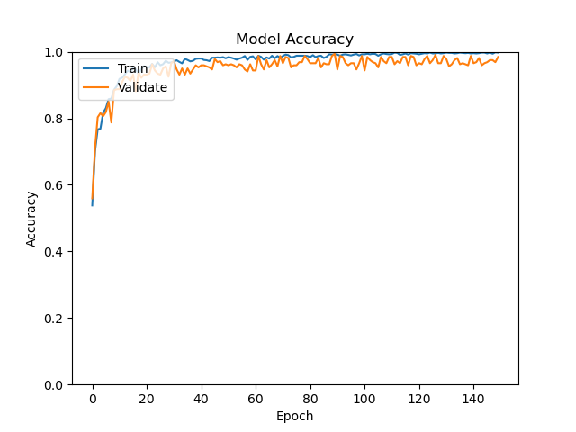
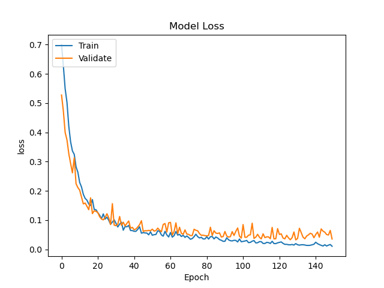
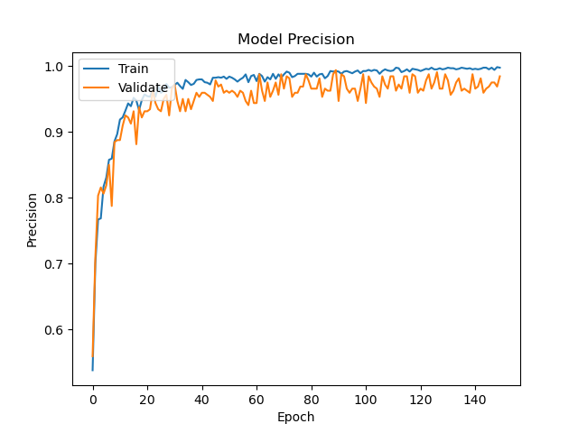
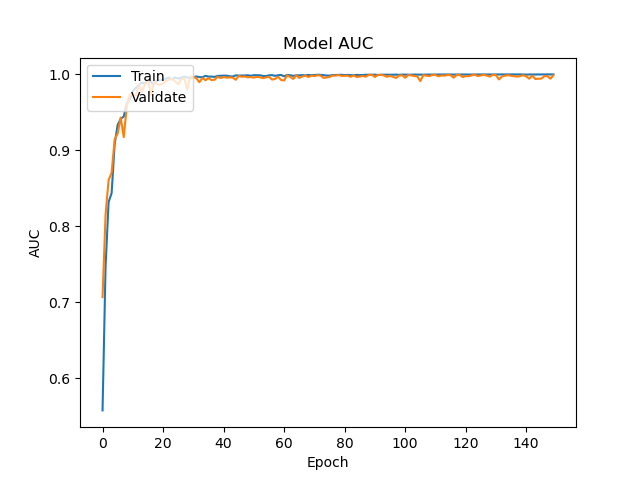

# Asociación de Investigacion en Inteligencia Artificial Para la Leucemia Peter Moss
## Acute Lymphoblastic Leukemia oneAPI Classifier
### Getting Started


&nbsp;

# Table Of Contents

- [Introduction](#introduction)
- [Installation](#installation)
- [Data](#data)
	- [Application Testing Data](#application-testing-data)
	- [Data Augmentation](#data-augmentation)
- [Network Architecture](#network-architecture)
- [Configuration](#configuration)
- [Metrics](#metrics)
- [Training](#training)
	- [Start Training](#start-training)
	- [Training Data](#training-data)
	- [Model Summary](#model-summary)
	- [Training Results](#training-results)
	- [Metrics Overview](#metrics-overview)
	- [ALL-IDB Required Metrics](#all-idb-required-metrics)
- [Contributing](#contributing)
  - [Contributors](#contributors)
- [Versioning](#versioning)
- [License](#license)
- [Bugs/Issues](#bugs-issues)

&nbsp;

# Introduction
This guide will guide you through the installation process for the Acute Lymphoblastic Leukemia oneAPI Classifier.

&nbsp;

# Installation
First you need to install the required software for training the model. Below are the available installation guides:

- [Ubuntu installation guide](installation/ubuntu.md) (Training).
- [Raspberry Pi 4 installation guide](installation/rpi4.md) (Inference on the edge).

&nbsp;

# Data
You need to be granted access to use the Acute Lymphoblastic Leukemia Image Database for Image Processing dataset. You can find the application form and information about getting access to the dataset on [this page](https://homes.di.unimi.it/scotti/all/#download) as well as information on how to contribute back to the project [here](https://homes.di.unimi.it/scotti/all/results.php).

_If you are not able to obtain a copy of the dataset please feel free to try this tutorial on your own dataset._

Once you have your data you need to add it to the project filesystem. You will notice the data folder in the Model directory, **model/data**, inside you have **train** & **test**. Add all of the images from the ALL_IDB1 dataset to the **model/data/train** folder.

## Application testing data

In the data processing stage, ten negative images and ten positive images are removed from the dataset and moved to the **model/data/test/** directory. This data is not seen by the network during the training process, and is used by applications.

To ensure your model gets the same results, please use the same test images. By default HIAS compatible projects will be expecting the same test images.  You can also try with your own image selection, however results may vary and you will need to make additional changes to our HIAS compatible projects.

To specify which test images to use modify the [configuration/config.json](../configuration/config.json) file as shown below:

```
"test_data": [
	"im006_1.jpg",
	"im020_1.jpg",
	"im024_1.jpg",
	"im026_1.jpg",
	"im028_1.jpg",
	"im031_1.jpg",
	"im035_0.jpg",
	"im041_0.jpg",
	"im047_0.jpg",
	"im053_1.jpg",
	"im057_1.jpg",
	"im060_1.jpg",
	"im063_1.jpg",
	"im069_0.jpg",
	"im074_0.jpg",
	"im088_0.jpg",
	"im095_0.jpg",
	"im099_0.jpg",
	"im101_0.jpg",
	"im106_0.jpg"
],
```

## Data Augmentation

You will create an augmented dataset based on the [Leukemia Blood Cell Image Classification Using Convolutional Neural Network](http://www.ijcte.org/vol10/1198-H0012.pdf "Leukemia Blood Cell Image Classification Using Convolutional Neural Network") by T. T. P. Thanh, Caleb Vununu, Sukhrob Atoev, Suk-Hwan Lee, and Ki-Ryong Kwon. In this case, you will use more rotated images to increase the dataset further.

&nbsp;

# Network Architecture
You will build a Convolutional Neural Network based on the proposed architecture in [Acute Leukemia Classification Using Convolution Neural Network In Clinical Decision Support System](https://airccj.org/CSCP/vol7/csit77505.pdf "Acute Leukemia Classification Using Convolution Neural Network In Clinical Decision Support System"). The network will consist of the following 5 layers (missing out the zero padding layers). Note you are usng an conv sizes of (100x100x30) whereas in the paper, the authors use (50x50x30).

- Conv layer (100x100x30)
- Conv layer (100x100x30)
- Max-Pooling layer (50x50x30)
- Fully Connected layer (2 neurons)
- Softmax layer (Output 2)

&nbsp;

## Configuration
[configuration/config.json](../configuration/config.json "configuration/config.json")  holds the configuration for our application.

- Change **agent->cores** to the number of cores you have on your training computer.
- Change **agent->server** to the local IP of your training device.
- Change **agent->port** to a different number.

```
{
    "agent": {
        "cores": 8,
        "server": "",
        "port": 1234,
        "params": [
            "train",
            "classify",
            "server",
            "classify_http"
        ]
    },
    "data": {
        "dim": 100,
        "file_type": ".jpg",
        "labels": [0, 1],
        "rotations": 10,
        "seed": 2,
        "split": 0.3,
        "test": "model/data/test",
        "test_data": [
            "Im006_1.jpg",
            "Im020_1.jpg",
            "Im024_1.jpg",
            "Im026_1.jpg",
            "Im028_1.jpg",
            "Im031_1.jpg",
            "Im035_0.jpg",
            "Im041_0.jpg",
            "Im047_0.jpg",
            "Im053_1.jpg",
            "Im057_1.jpg",
            "Im060_1.jpg",
            "Im063_1.jpg",
            "Im069_0.jpg",
            "Im074_0.jpg",
            "Im088_0.jpg",
            "Im095_0.jpg",
            "Im099_0.jpg",
            "Im101_0.jpg",
            "Im106_0.jpg"
        ],
        "train_dir": "model/data/train",
        "valid_types": [
            ".JPG",
            ".JPEG",
            ".PNG",
            ".GIF",
            ".jpg",
            ".jpeg",
            ".png",
            ".gif"
        ]
    },
    "model": {
        "device": "CPU",
        "freezing_log_dir": "model/freezing",
        "frozen": "frozen.pb",
        "ir": "model/ir/frozen.xml",
        "model": "model/model.json",
        "saved_model_dir": "model",
        "weights": "model/weights.h5"
    },
    "train": {
        "batch": 100,
        "decay_adam": 1e-6,
        "epochs": 150,
        "learning_rate_adam": 1e-4,
        "val_steps": 10
    }
}
```

The configuration object contains 4 Json Objects (agent, data, model and train). Agent has the information used to set up your server, data has the configuration related to preparing the training and validation data, model holds the model file paths, and train holds the training parameters.

&nbsp;

# Metrics
We can use metrics to measure the effectiveness of our model. In this network you will use the following metrics:

```
tf.keras.metrics.BinaryAccuracy(name='accuracy'),
tf.keras.metrics.Precision(name='precision'),
tf.keras.metrics.Recall(name='recall'),
tf.keras.metrics.AUC(name='auc')
```

These metrics will be displayed and plotted once our model is trained.  A useful tutorial while working on the metrics was the [Classification on imbalanced data](https://www.tensorflow.org/tutorials/structured_data/imbalanced_data) tutorial on Tensorflow's website.

&nbsp;

# Training
Now you are ready to train your model.

## Start Training
Ensuring you have completed all previous steps, you can start training using the following command.

```
python agent.py train
```

This tells the application to start training the model.

## Training Data
First the training and validation data will be prepared.

```
2021-05-02 02:40:06,901 - Agent - INFO - Data shape: (1584, 100, 100, 3)
2021-05-02 02:40:06,902 - Agent - INFO - Labels shape: (1584, 2)
2021-05-02 02:40:06,902 - Agent - INFO - Raw data: 792
2021-05-02 02:40:06,902 - Agent - INFO - Raw negative data: 441
2021-05-02 02:40:06,903 - Agent - INFO - Raw positive data: 351
2021-05-02 02:40:06,903 - Agent - INFO - Augmented data: (1584, 100, 100, 3)
2021-05-02 02:40:06,903 - Agent - INFO - Labels: (1584, 2)
2021-05-02 02:40:07,125 - Agent - INFO - Training data: (1180, 100, 100, 3)
2021-05-02 02:40:07,125 - Agent - INFO - Training labels: (1180, 2)
2021-05-02 02:40:07,125 - Agent - INFO - Validation data: (404, 100, 100, 3)
2021-05-02 02:40:07,125 - Agent - INFO - Validation labels: (404, 2)
2021-05-02 02:40:07,132 - Agent - INFO - Data preperation complete.
```

### Model Summary

Before the model begins training, you will be shown the model summary.

```
Model: "AllOneApiClassifier"
_________________________________________________________________
Layer (type)                 Output Shape              Param #
=================================================================
zero_padding2d (ZeroPadding2 (None, 104, 104, 3)       0
_________________________________________________________________
conv2d (Conv2D)              (None, 100, 100, 30)      2280
_________________________________________________________________
zero_padding2d_1 (ZeroPaddin (None, 104, 104, 30)      0
_________________________________________________________________
conv2d_1 (Conv2D)            (None, 100, 100, 30)      22530
_________________________________________________________________
max_pooling2d (MaxPooling2D) (None, 50, 50, 30)        0
_________________________________________________________________
flatten (Flatten)            (None, 75000)             0
_________________________________________________________________
dense (Dense)                (None, 2)                 150002
_________________________________________________________________
activation (Activation)      (None, 2)                 0
=================================================================
Total params: 174,812
Trainable params: 174,812
Non-trainable params: 0
_________________________________________________________________
2021-05-02 02:40:07,186 - Agent - INFO - Network initialization complete.
2021-05-02 02:40:07,186 - Agent - INFO - Using Adam Optimizer.
Train on 1180 samples, validate on 404 samples
```

Our network matches the architecture proposed in the paper.

## Training Results
Below are the training results for 150 epochs.



_Fig 2. Accuracy_



_Fig 3. Loss_



_Fig 4. Precision_


_Fig 5. Recall_



_Fig 6. AUC_

```
2021-05-02 03:18:38,259 - Agent - INFO - Metrics: loss 0.04992164568145677
2021-05-02 03:18:38,259 - Agent - INFO - Metrics: acc 0.9826733
2021-05-02 03:18:38,259 - Agent - INFO - Metrics: precision 0.9826733
2021-05-02 03:18:38,260 - Agent - INFO - Metrics: recall 0.9826733
2021-05-02 03:18:38,260 - Agent - INFO - Metrics: auc 0.99847436

2021-05-02 03:18:38,917 - Agent - INFO - Confusion Matrix: [[220   1][  6 177]]

2021-05-02 03:18:39,054 - Agent - INFO - True Positives: 177(43.81188118811881%)
2021-05-02 03:18:39,054 - Agent - INFO - False Positives: 1(0.24752475247524752%)
2021-05-02 03:18:39,054 - Agent - INFO - True Negatives: 220(54.45544554455446%)
2021-05-02 03:18:39,054 - Agent - INFO - False Negatives: 6(1.4851485148514851%)
2021-05-02 03:18:39,054 - Agent - INFO - Specificity: 0.995475113122172
2021-05-02 03:18:39,054 - Agent - INFO - Misclassification: 7(1.7326732673267327%)

```

## Metrics Overview
| Accuracy | Recall | Precision | AUC/ROC |
| ---------- | ---------- | ---------- | ---------- |
| 0.9826733 | 0.9826733 | 0.9826733 | 0.99847436 |

## ALL-IDB Required Metrics
| Figures of merit     | Amount/Value | Percentage |
| -------------------- | ----- | ---------- |
| True Positives       | 177 | 43.81188118811881% |
| False Positives      | 1 | 0.24752475247524752% |
| True Negatives       | 220 | 54.45544554455446% |
| False Negatives      | 6 | 1.4851485148514851% |
| Misclassification    | 7 | 1.7326732673267327% |
| Sensitivity / Recall | 0.9826733   | 0.98% |
| Specificity          | 0.995475113122172  | 100% |

&nbsp;

# Contributing

The Peter Moss Acute Myeloid & Lymphoblastic Leukemia AI Research project encourages and youlcomes code contributions, bug fixes and enhancements from the Github.

Please read the [CONTRIBUTING](../CONTRIBUTING.md "CONTRIBUTING") document for a full guide to forking our repositories and submitting your pull requests. You will also find information about our code of conduct on this page.

## Contributors

- [Adam Milton-Barker](https://www.leukemiaresearchassociation.ai/team/adam-milton-barker "Adam Milton-Barker") - [Asociacion De Investigacion En Inteligencia Artificial Para La Leucemia Peter Moss](https://www.leukemiaresearchassociation.ai "Asociacion De Investigacion En Inteligencia Artificial Para La Leucemia Peter Moss") President/Founder & Lead Developer, Sabadell, Spain

&nbsp;

# Versioning

You use SemVer for versioning. For the versions available, see [Releases](../releases "Releases").

&nbsp;

# License

This project is licensed under the **MIT License** - see the [LICENSE](../LICENSE "LICENSE") file for details.

&nbsp;

# Bugs/Issues

You use the [repo issues](../issues "repo issues") to track bugs and general requests related to using this project. See [CONTRIBUTING](../CONTRIBUTING.md "CONTRIBUTING") for more info on how to submit bugs, feature requests and proposals.