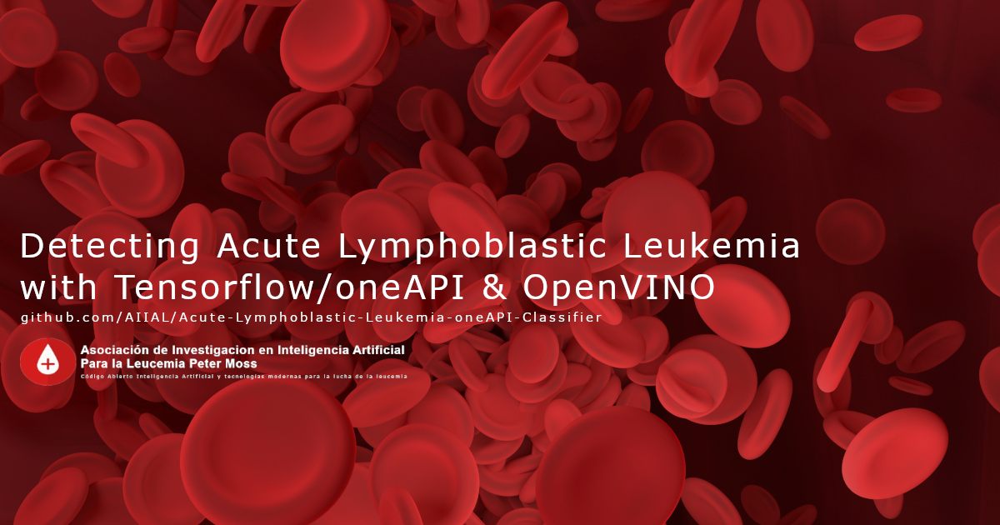

# Asociación de Investigacion en Inteligencia Artificial Para la Leucemia Peter Moss
## Acute Lymphoblastic Leukemia oneAPI Classifier
### Ubuntu Installation



&nbsp;

# Table Of Contents

- [Introduction](#introduction)
- [Prerequisites](#prerequisites)
	- [Anaconda](#anaconda)
- [Installation](#installation)
	- [Intel® Optimization for TensorFlow](#intel-optimization-for-tensorflow)
	- [Intel® Distribution of OpenVINO™ Toolkit](#intel-distribution-of-openvino-toolkit)
	- [Clone The Repository](#clone-the-repository)
		- [Developer Forks](#developer-forks)
	- [Setup File](#setup-file)
	- [Continue](#continue)
- [Contributing](#contributing)
  - [Contributors](#contributors)
- [Versioning](#versioning)
- [License](#license)
- [Bugs/Issues](#bugs-issues)

# Introduction
This guide will guide you through the installation process for the Acute Lymphoblastic Leukemia oneAPI Classifier.

# Prerequisites
You will need to ensure you have the following prerequisites installed and setup.

## Anaconda
If you haven't already installed Anaconda you will need to install it now. Follow the [Anaconda installation guide](https://docs.anaconda.com/anaconda/install/ "Anaconda installation guide") to do so.

### HIAS Server
For this project you will need a functioning [HIAS Server](https://github.com/LeukemiaAiResearch/HIAS). To install the HIAS Server, follow the [HIAS Server Installation Guide](https://github.com/LeukemiaAiResearch/HIAS/blob/master/Documentation/Installation/Installation.md)

# Installation
You are now ready to install the Acute Lymphoblastic Leukemia oneAPI Classifier software.

## Intel® Optimization for TensorFlow
Now you will install the Intel® Optimization for TensorFlow using Anaconda.

```
conda create -n all-tfmkl python=3
conda activate all-tfmkl
conda install tensorflow -c anaconda
conda deactivate
```

## Intel® Distribution of OpenVINO™ Toolkit
Now you will install Intel® Distribution of OpenVINO™ Toolkit which will be used to convert your frozen model into an Intermediate Representation.

```
wget https://apt.repos.intel.com/openvino/2021/GPG-PUB-KEY-INTEL-OPENVINO-2021
echo "deb https://apt.repos.intel.com/openvino/2021 all main" | sudo tee /etc/apt/sources.list.d/intel-openvino-2021.list
sudo apt update
sudo apt install intel-openvino-runtime-ubuntu18-2021.1.110
```
## Clone the repository

Clone the [Acute Lymphoblastic Leukemia oneAPI Classifier](https://github.com/AIIAL/Acute-Lymphoblastic-Leukemia-oneAPI-Classifier " Acute Lymphoblastic Leukemia oneAPI Classifier") repository from the [Peter Moss Acute Myeloid & Lymphoblastic Leukemia AI Research Project](https://github.com/AIIAL "Asociación de Investigacion en Inteligencia Artificial Para la Leucemia Peter Moss") Github Organization.

To clone the repository and install the OneAPI Acute Lymphoblastic Leukemia Classifier Classifier, make sure you have Git installed. Now navigate to the a directory on your device using commandline, and then use the following command.

```
 git clone https://github.com/AIIAL/Acute-Lymphoblastic-Leukemia-oneAPI-Classifier.git
```

Once you have used the command above you will see a directory called **Acute-Lymphoblastic-Leukemia-oneAPI-Classifier** in your home directory.

```
 ls
```

Using the ls command in your home directory should show you the following.

```
 Acute-Lymphoblastic-Leukemia-oneAPI-Classifier
```

Navigate to the **Acute-Lymphoblastic-Leukemia-oneAPI-Classifier** directory, this is your project root directory for this tutorial.

### Developer Forks

Developers from the Github community that would like to contribute to the development of this project should first create a fork, and clone that repository. For detailed information please view the [CONTRIBUTING](../../CONTRIBUTING.md "CONTRIBUTING") guide. You should pull the latest code from the development branch.

```
 git clone -b "1.1.0" https://github.com/AIIAL/Acute-Lymphoblastic-Leukemia-oneAPI-Classifier.git
```

The **-b "1.1.0"** parameter ensures you get the code from the latest master branch. Before using the below command please check our latest master branch in the button at the top of the project README.

## Setup File

All other software requirements are included in **scripts/install.sh**. You can run this file on your machine from the project root in terminal. Use the commands that follow:

```
 conda activate all-tfmkl
 sh scripts/install.sh
 conda deactivate
```

# Continue
When you are ready to continue, activate your Anaconda environment:
```
 conda activate all-tfmkl
```
Now you can continue with the Acute Lymphoblastic Leukemia oneAPI Classifier [getting started guide](../getting-started.md)

&nbsp;

# Contributing

The Peter Moss Acute Myeloid & Lymphoblastic Leukemia AI Research project encourages and youlcomes code contributions, bug fixes and enhancements from the Github.

Please read the [CONTRIBUTING](../../CONTRIBUTING.md "CONTRIBUTING") document for a full guide to forking our repositories and submitting your pull requests. You will also find information about our code of conduct on this page.

## Contributors

- [Adam Milton-Barker](https://www.leukemiaresearchassociation.ai/team/adam-milton-barker "Adam Milton-Barker") - [Asociacion De Investigacion En Inteligencia Artificial Para La Leucemia Peter Moss](https://www.leukemiaresearchassociation.ai "Asociacion De Investigacion En Inteligencia Artificial Para La Leucemia Peter Moss") President/Founder & Lead Developer, Sabadell, Spain

&nbsp;

# Versioning

You use SemVer for versioning. For the versions available, see [Releases](../../releases "Releases").

&nbsp;

# License

This project is licensed under the **MIT License** - see the [LICENSE](../../LICENSE "LICENSE") file for details.

&nbsp;

# Bugs/Issues

You use the [repo issues](../../issues "repo issues") to track bugs and general requests related to using this project. See [CONTRIBUTING](../../CONTRIBUTING.md "CONTRIBUTING") for more info on how to submit bugs, feature requests and proposals.